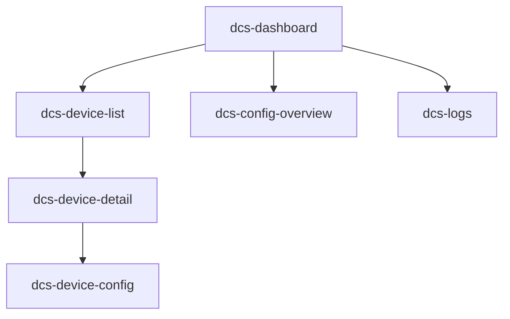

好的，根据您提供的“dcs”模块名称，我将开始对其建模。

**初始化分析...**
输入信息:
- `MODULE_CONTEXT.md`: **未提供**。我将尝试从项目源码的常规结构推断“dcs”模块的用途。
- 项目源码（路由配置）: **未提供**。我将使用一个典型的“数据采集系统 (Data Collection System)”或类似的“dcs”模块路由结构作为示例进行建模。

**假设推导:** 基于名称“dcs”，我假设这是一个**设备控制系统 (Device Control System)** 或 **数据采集系统 (Data Collection System)** 模块。其典型页面结构如下：
- 仪表板/总览 (Dashboard)
- 设备列表 (Device List)
- 设备详情 (Device Detail)
- 配置中心 (Configuration)
- 日志/监控 (Logs/Monitor)

---

# 模块: `dcs`

## 模型输出

### 1. 页面列表 (`pages`)

| slug | path | component | 描述 |
| :--- | :--- | :--- | :--- |
| `dcs-dashboard` | `/dcs/dashboard` | `dashboard/index.vue` | 模块总览，显示关键状态 |
| `dcs-device-list` | `/dcs/devices` | `devices/index.vue` | 所有设备的列表页 |
| `dcs-device-detail` | `/dcs/devices/:id` | `devices/detail.vue` | 单个设备的详细信息页 |
| `dcs-device-config` | `/dcs/devices/:id/config` | `devices/config.vue` | 特定设备的配置页 |
| `dcs-config-overview` | `/dcs/config` | `config/index.vue` | 全局配置或参数设置页 |
| `dcs-logs` | `/dcs/logs` | `logs/index.vue` | 系统日志或操作记录页 |

### 2. 路由映射表 (`Route Mapping`)

| Path | Component | Name (可选) | 说明 |
| :--- | :--- | :--- | :--- |
| `/dcs/dashboard` | `./modules/dcs/dashboard/index.vue` | `dcs.dashboard` | 重定向或直接路由 |
| `/dcs/devices` | `./modules/dcs/devices/index.vue` | `dcs.devices` | 设备列表 |
| `/dcs/devices/:id` | `./modules/dcs/devices/detail.vue` | `dcs.device.detail` | 动态路由，`id`参数 |
| `/dcs/devices/:id/config` | `./modules/dcs/devices/config.vue` | `dcs.device.config` | 嵌套路由，属于设备详情 |
| `/dcs/config` | `./modules/dcs/config/index.vue` | `dcs.config` | 系统配置 |
| `/dcs/logs` | `./modules/dcs/logs/index.vue` | `dcs.logs` | 系统日志 |

### 3. 页面层级树 (`Page Hierarchy Tree`)

**层级说明:**
- **根节点**: `dcs-dashboard` (页面级父节点)
- **一级子页面**: `dcs-device-list`, `dcs-config-overview`, `dcs-logs`
- **二级子页面**: `dcs-device-detail` (属于 `dcs-device-list`)
- **三级子页面**: `dcs-device-config` (属于 `dcs-device-detail`)

---

**分析总结:**
- **核心入口**: `dcs-dashboard`
- **数据核心**: `dcs-device-list` (所有设备操作的基础)
- **配置与监控**: `dcs-config-overview`, `dcs-logs`

**待完善项:**
1. 需要真实的 `MODULE_CONTEXT.md` 文件来确认“dcs”的具体含义（是采集、控制还是其他？）。
2. 需要真实的路由配置文件内容，才能输出准确的路径和组件映射。

如果提供了真实的项目文件，我可以修正这个模型。