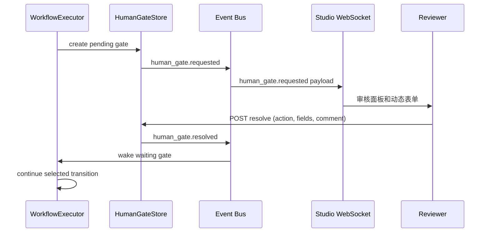

# P8-2 — Human-in-the-Loop 节点设计

## 目标与边界

让 Workflow 的 `human_gate` 节点在需要人工决策时暂停 Run、将可审核上下文推送给 Studio，并在收到一次有效决定后恢复执行。

本设计不改动 Frozen Core（`ExecutionService`、`Run`、`RunEvent`、`EventBus`）。HITL 作为 RunEvent Consumer 和 API/UI 扩展实现。

当前 `aitest/platform/workflow_executor.py` 的 `execute_human_gate_node()` 仅返回 `default_action`；本设计以替换该降级行为为目标。现有 `/api/v1/chat/tasks/{task_id}/pause-status` 与 `/resume` 仅服务 Chat 任务暂停，不能作为 Workflow HITL 的数据模型。

## 交互流程



Run 继续执行的唯一触发条件是 `resolved`、`timed_out` 或 `cancelled`；重复提交必须返回已决议记录，而不能覆盖决议。

## 状态与权限

| 状态 | 含义 | 可转移至 |
|---|---|---|
| `pending` | 等待人工审核 | `approved`、`rejected`、`changes_requested`、`timed_out`、`cancelled` |
| `approved` | 允许继续默认成功分支 | 终态 |
| `rejected` | 拒绝并进入拒绝分支 | 终态 |
| `changes_requested` | 需要修改，附带意见 | 终态 |
| `timed_out` | 到期未处理，使用显式 timeout action | 终态 |
| `cancelled` | Run 被取消 | 终态 |

MVP 以单租户身份 `approver` 字段记录当前 Studio 用户或 `local`。后续接入 RBAC 时，只允许具备 `workflow:approve` 的成员 resolve；创建 Run 的用户不能绕过审批权限。

## WebSocket 协议

连接：`GET ws://<host>/api/v1/human-gates/ws?run_id=<run_id>`。连接成功后服务端立即补发该 Run 的全部 `pending` Gate，避免刷新页面造成状态丢失。

### 服务端事件

```json
{
  "type": "human_gate.requested",
  "event_id": "evt_01J...",
  "occurred_at": "2026-07-11T12:00:00Z",
  "gate": {
    "id": "gate_01J...",
    "run_id": "run_01J...",
    "node_id": "release-review",
    "title": "审核测试策略",
    "prompt": "确认风险项和覆盖范围后继续。",
    "context": {"risk_score": 72, "artifacts": ["artifact_1"]},
    "actions": ["approve", "request_changes", "reject"],
    "form_schema": {"version": "1.0", "fields": []},
    "expires_at": "2026-07-11T13:00:00Z"
  }
}
```

终态使用 `human_gate.resolved`，并发送完整的 `resolution`；心跳使用 `{ "type": "ping" }` / `{ "type": "pong" }`。客户端不通过 WebSocket 写入决议，所有决议必须走 REST，便于认证、幂等和审计。

## 动态表单 Schema

`form_schema` 为受限 JSON Schema 子集，禁止执行脚本或远程引用。

```json
{
  "version": "1.0",
  "fields": [
    {
      "id": "risk_acknowledged",
      "label": "已阅读风险项",
      "type": "checkbox",
      "required": true
    },
    {
      "id": "comment",
      "label": "审核意见",
      "type": "textarea",
      "max_length": 2000,
      "required_when": {"action": ["request_changes", "reject"]}
    }
  ]
}
```

支持字段：`text`、`textarea`、`select`、`radio`、`checkbox`、`number`、`date`。服务端根据 schema 验证字段 ID、类型、必填、枚举值、长度和条件必填；未知字段拒绝写入。

## 数据模型

```sql
CREATE TABLE human_gate_approvals (
  id TEXT PRIMARY KEY,
  run_id TEXT NOT NULL,
  node_id TEXT NOT NULL,
  status TEXT NOT NULL,
  prompt TEXT NOT NULL,
  context_json TEXT NOT NULL DEFAULT '{}',
  actions_json TEXT NOT NULL,
  form_schema_json TEXT NOT NULL DEFAULT '{"version":"1.0","fields":[]}',
  resolution_json TEXT,
  approver TEXT,
  idempotency_key TEXT,
  created_at TEXT NOT NULL,
  expires_at TEXT,
  resolved_at TEXT,
  UNIQUE(run_id, node_id),
  UNIQUE(run_id, idempotency_key)
);
CREATE INDEX idx_human_gate_pending ON human_gate_approvals(run_id, status);
```

决议采用条件更新 `WHERE status = 'pending'`，保证首次成功的 resolve 获胜。`resolution_json` 必含 `action`、`fields`、`comment`、`resolved_by` 与时间戳。

## HTTP API

| 方法 | 端点 | 行为 |
|---|---|---|
| `GET` | `/api/v1/runs/{run_id}/human-gates` | 列出 Gate，可按 `status` 筛选 |
| `GET` | `/api/v1/runs/{run_id}/human-gates/{gate_id}` | 获取单个 Gate |
| `POST` | `/api/v1/runs/{run_id}/human-gates/{gate_id}/resolve` | 提交一次决议 |
| `POST` | `/api/v1/runs/{run_id}/human-gates/{gate_id}/cancel` | 仅 Run 取消流程调用 |

`resolve` 请求：

```json
{
  "action": "approve",
  "fields": {"risk_acknowledged": true},
  "comment": "风险范围已确认。"
}
```

要求 `Idempotency-Key` 请求头。成功返回 `200`；相同 key 返回同一结果；已由其他审核人解决返回 `409 human_gate_already_resolved`。

## Studio UI

新增 `HumanGatePanel.tsx`：在 Run 页面或右侧 Inspector 显示 pending Gate。组件由 WebSocket 初始快照和事件驱动更新，并在断线时以 REST 每 15 秒回补。

- 标题、提示词和上下文摘要优先显示；大体积 artifact 提供链接，不内嵌不可信 HTML。
- `HumanGateForm.tsx` 根据受限 schema 渲染 shadcn 控件，提交前本地验证，服务端错误逐字段显示。
- 审批、要求修改、拒绝为明确文本按钮；拒绝和要求修改需要意见。
- 提交期间按钮禁用且保留用户输入；收到终态事件显示审核人、决议和时间。
- 到期前 5 分钟以 warning 语义提示，不能自动点击默认动作。

## 超时与故障处理

`human_gate` 定义 `timeout_seconds` 与 `on_timeout`（`approve`、`reject`、`fail_run`）；两者都必须显式声明，禁止隐式 `default_action`。调度器每分钟查找过期 `pending` Gate，以条件更新写入 `timed_out` 并发出事件。服务器重启后，WorkflowExecutor 从 Store 重建未完成等待；若 Run 已不存在，将 Gate 标为 `cancelled`。

## 实施分期与验收

1. **持久化与 REST**：迁移、`HumanGateStore`、幂等 resolve、状态转换单元测试。
2. **执行器接入**：创建 Gate、等待通知、超时恢复；覆盖 approve/reject/timeout/restart。
3. **事件与 WebSocket**：Event Bus consumer、补发、断线重连测试。
4. **Studio**：`HumanGatePanel`、动态表单、Run Inspector 集成、键盘及 WCAG AA 验证。

验收：同一 Gate 不能被两次决议；刷新 Studio 后仍能看到 pending Gate；超时动作可审计；RunEvent 和数据库中的最终决议一致；不修改 ExecutionService 核心流程。
