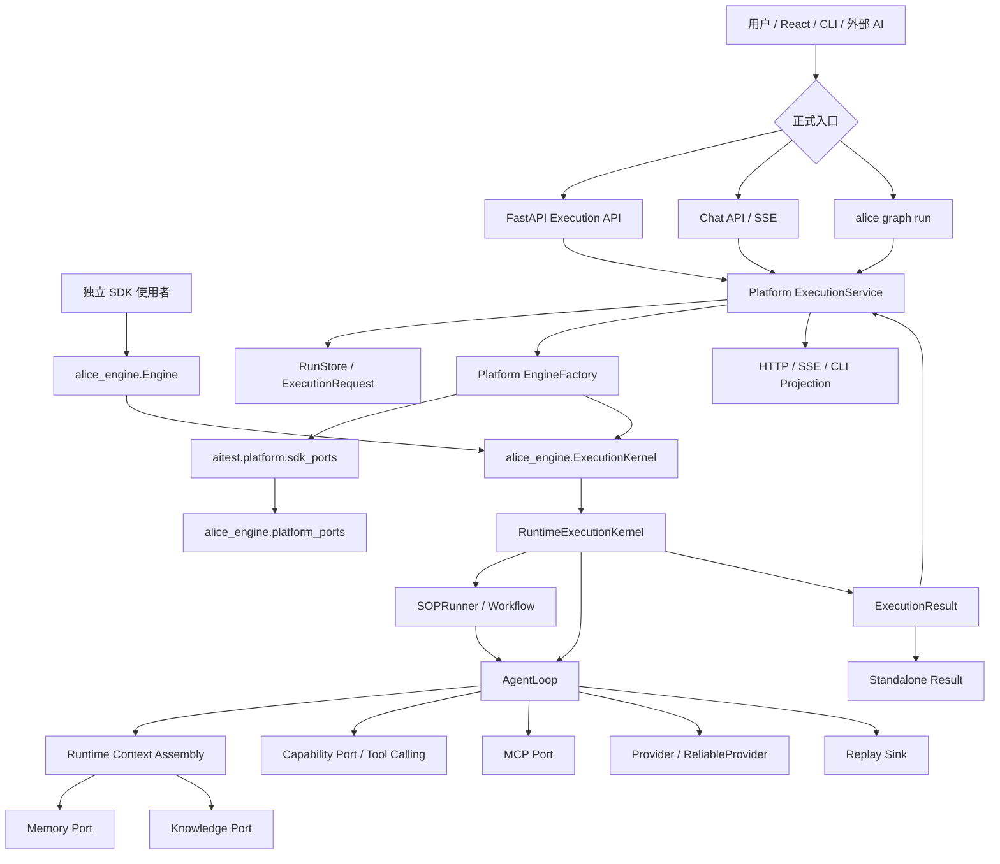

# Principal AI Engineer 阶段复审

> 首次评估：2026-07-06  
> 本次复审：2026-07-08  
> 评估对象：当前工作区快照  
> 说明：文件名沿用 `Principle AI Engineer.md`，正文按 Principal AI Engineer 架构复审口径修订。本文记录 Phase 1-7 当前真实状态，不等同于已提交、已发布、线上验收完成的版本。

## 结论先行

AITest 的架构定位已经从：

> Platform 主链已接通，但 SDK 执行内核、平台编排契约、发布和依赖边界尚未收口。

推进到：

> Platform 与 Standalone SDK 已经共用公开 `ExecutionKernel` 主链，`platform_bridge` 的动态 `aitest.*` 加载已替换为显式 Port 注入；Phase 7 发布基线与 SDK 独立发布验收已由用户确认全部走完。下一阶段应进入 V2 “可治理的模块化单体”，重点是边界减重、依赖门禁、合同固化和组合根治理。

本阶段完成了几个关键转折：

- `packages/alice-engine/alice_engine/kernel.py` 已定义公开 `ExecutionKernel`、`KernelExecutionRequest`、`InlineExecutionKernel`、`RuntimeExecutionKernel`。
- `alice_engine.Engine.run()` 已通过公开 Kernel 执行，不再把 `_internal.graph` 当作公开行为根基。
- Platform `ExecutionService / EngineFactory` 已接入同一 Kernel 路径，平台仍保留 Scope、RunStore、Audit、租户和结果投影职责。
- `packages/alice-engine/alice_engine/platform_bridge.py` 已改为读取 `platform_ports` 注册表，不再字符串动态导入 `aitest.*`。
- `aitest/platform/sdk_ports.py` 成为 Platform Adapter 向 SDK Port 注入的组合点。
- CI 与 Dockerfile 已补齐 workspace package 安装链，`sdk-standalone` job 已加入 wheel 构建和 clean env smoke。
- 本地 CI 风格回归已通过：`1344 passed, 2 skipped`。
- 本地测试收集已恢复到 `1346 collected`。
- 本地 `alice-engine` wheel 构建通过，installed-wheel smoke 已确认最小 SDK facade 路径可运行，且 smoke 过程未把 `aitest` 导入到 `sys.modules`。
- 已新增 `scripts/phase7_acceptance.ps1`，用于联网环境一键执行 Phase 7 验收。

仍必须保持清醒：

- `PH7-PR-7.1` 到 `PH7-PR-7.6` 已全部完成。
- Phase 7 解决的是可信发布基线、统一执行内核、SDK 独立发布边界；后续不应再围绕这些主题重复做宏观分析。
- Phase 8 开始进入 V2 模块治理，目标是让已经接入主链的能力具备清晰合同、可测边界和可持续演进空间。
- 工作区仍是 dirty snapshot，不是可复现 release baseline。

当前最高优先级不再是继续证明“能力存在”或“发布链可跑”，而是让主链内部边界可治理：

```text
dependency graph and SCC gate
+ runtime contract pack
+ AgentLoop boundary reduction
+ platform composition roots
+ Tool/MCP lifecycle contract
+ Provider single source of truth
```

------

# 一、当前目标架构

## 1.1 正确的分层关系

当前架构目标已经可以明确为“一个公开执行内核，两个应用 Facade”：

```text
Platform API / CLI / Chat                Standalone SDK Consumer
            |                                      |
Platform ExecutionService                     alice_engine.Engine
            |                                      |
Tenant / Run / Audit / Queue Adapter     Standalone Configuration
            +------------------+-------------------+
                               |
                 alice-engine ExecutionKernel
                               |
              RuntimeExecutionKernel / SOPRunner
                               |
          AgentLoop / Workflow / Provider / Ports
                               |
      Capability / Memory / Knowledge / Replay / MCP
                               |
                    ExecutionResult
```

这个方向比前一轮评估更健康，因为它没有让 SDK 反向依赖 Platform：

- `ExecutionService` 留在 `aitest`，继续承担租户、Scope、Run 生命周期、幂等、审计、Billing、Webhook、平台事件和 UI Projection。
- `alice_engine.Engine` 是 standalone facade，只负责独立 SDK 使用者的轻量执行入口。
- `ExecutionKernel` 是共享语义层，负责执行输入输出、同步/异步调用、Agent/SOP 运行与结果归一。
- Capability、Memory、Knowledge、Replay、MCP 通过显式 Port 或 Adapter 注入，避免 SDK 内部偷偷加载 Platform。

## 1.2 当前真实执行链



这张图代表当前主线判断：

1. CLI、Execution API、Chat 主入口已经向 Platform `ExecutionService` 收敛。
2. Platform `ExecutionService / EngineFactory` 与 standalone `alice_engine.Engine` 已共享公开 Kernel。
3. SDK 不再需要通过动态 `import_module("aitest...")` 获得 Platform 能力。
4. Platform 的企业语义没有被塞进 SDK，依赖方向仍是 Platform 调 SDK。
5. 剩余治理重点已经从“主链是否存在、发布环境是否可复现”转为“主链内部边界是否可测、可拆、可治理”。

## 1.3 当前关键偏差

已经解决的旧偏差：

- SDK `Engine.run()` 不再以 `_internal.graph` 作为公开执行根基。
- Platform 与 SDK 不再各自拥有一套事实执行主线。
- `platform_bridge` 不再通过字符串动态加载 `aitest.*`。
- 测试收集不再卡在导入错误，当前本地可收集 `1346`。
- Dockerfile 不再遗漏 `packages/` workspace 安装。

仍存在的偏差：

- 依赖图和 SCC 尚未成为持续门禁。
- Runtime Event、Context、Replay、Checkpoint、Artifact 合同仍需要冻结。
- Tool/MCP async 生命周期仍需要统一。
- Provider 仍需要收敛为 SDK 单一事实源，`aitest.llm` 只保留兼容 facade。
- 工作区仍包含大量未提交改动，当前状态必须视作进行中的大快照。
- 真实一级包依赖图是否已经明显解环，尚未重新纳入自动门禁。
- `aitest/platform/` 与 `alice_engine/core/executor.py` 仍承担过多集成职责，God Package 风险只是被控制住，并未消失。
- Run-scoped Context 仍需继续替代部分进程环境变量和 singleton fallback。

------

# 二、模块职责复审

| 模块 | 当前状态 | 判断 |
|---|---|---|
| `alice-engine/kernel.py` | 公开 Kernel 合同已建立 | Phase 7 的核心成果；后续应保持 API 稳定并补 SemVer 门禁 |
| `alice-engine/engine.py` | Standalone `Engine` 已切到 Kernel | 不再是 `_internal.graph` facade；仍需线上 wheel smoke 证明 |
| `aitest/platform/execution_service.py` | Platform Facade 保留平台语义 | 方向正确，不应下沉到 SDK |
| `aitest/platform/engine_factory.py` | 负责平台组合与 Kernel 创建 | 仍偏重，但职责比旧版更清楚 |
| `alice-engine/platform_bridge.py` | 改为显式 Port 注册读取 | 动态 Platform Bridge 问题本地已收口 |
| `aitest/platform/sdk_ports.py` | Platform Adapter 注入点 | 这是合理的 composition root，应继续保持薄层 |
| Runtime / AgentLoop | 仍是执行能力中心 | 功能集中，后续需要拆 Provider、Context、Tool、Replay 生命周期 |
| Workflow / SOPRunner | 已在 SDK 内承担 SOP 主流程 | 需要继续稳定 State、Checkpoint、Gate 合同 |
| Capability / MCP | 已通过 Port 接入 | MCP async 生命周期仍是后续风险点 |
| Memory / Knowledge | 已接入上下文主链 | 需要继续加强租户 namespace、失败策略和可观测性 |
| Replay | 已进入执行链 | Core model 与平台 SQL Adapter 仍可继续拆分 |
| CI / Docker / Release | 基线配置已补上 | 还缺真实线上执行结果 |

## God Package 风险

当前最高风险仍在三个位置：

1. `aitest/platform/`：承担应用服务、企业控制面、数据访问、Capability、Memory、Replay、Scheduler、Metrics 等组合职责。
2. `alice_engine/core/executor.py`：承担 AgentLoop、Provider、Capability、MCP、Memory、Knowledge、Replay、Continuation 与清理逻辑。
3. `aitest/server/api/execution.py`：混合 Command、Query、Debug、Audit、Report、Billing、Webhook 等 API 面。

这不是当前 Phase 7 的发布阻断，但它决定了下一阶段不应继续横向堆能力。下一阶段更适合做“边界减重”：把 Port、Event、Context、Replay、Provider 的合同固化出来，再逐步拆实现。

------

# 三、依赖与边界

## 3.1 已守住的边界

- `alice-engine` 运行时代码中未发现 `from aitest`、`import aitest` 或动态 `import_module("aitest...")`。
- `platform_bridge.py` 只读取 `alice_engine.platform_ports.get_platform_ports()`。
- Platform 通过 `aitest.platform.sdk_ports.register_platform_ports()` 注入能力。
- Standalone SDK 在没有 `aitest` 的 smoke 中可以导入 `alice_engine` 并运行最小 Kernel/Engine 路径。

## 3.2 仍需治理的边界

- `infra -> platform`、`platform -> infra` 等历史环路仍需重新量化和纳入 CI。
- `aitest.llm` 与 SDK Provider 层仍存在兼容 facade，后续要避免双实现漂移。
- `aitest.graphs / runtime / engine` 等兼容路径还需要弃用周期和删除计划。
- Platform singleton fallback 仍可能绕过显式 DI。
- 进程环境变量仍可能承载部分执行上下文。

## 3.3 建议新增门禁

后续应把下面检查变成 CI 固定项：

```text
1. packages/alice-engine 源码不得 import aitest，也不得动态 import aitest
2. installed wheel smoke 中 import alice_engine 后 sys.modules 不得出现 aitest
3. SDK standalone smoke 必须在 clean env 运行
4. platform facade 测试与 kernel contract 测试分离
5. 一级包 SCC 体积不得继续扩大
```

------

# 四、测试、CI 与发布基线

## 4.1 当前本地证据

当前已有本地证据：

- `pytest --collect-only -q -p no:cacheprovider aitest/tests packages/alice-engine/tests`：`1346 collected`
- `pytest -q -p no:cacheprovider -m "not slow and not llm" packages/alice-engine/tests aitest/tests`：`1344 passed, 2 skipped`
- `python -m build --wheel packages/alice-engine`：wheel 构建通过
- installed-wheel smoke：`import alice_engine`、`GovernanceRouter`、`platform_bridge`、`InlineExecutionKernel`、`Engine(..., kernel=...)` 可运行
- `sdk-standalone` CI 脚本已修正 `request.request_id` 漂移，改为 `request.context.request_id`
- `scripts/phase7_acceptance.ps1 -DryRun` 已验证脚本步骤展开正常

## 4.2 Phase 7 后的新增计划

Phase 7 已经全部走完后，发布验收不再是当前主线。下一阶段计划已拆成：

- [phase-8-pr-backlog.md](/D:/Desktop/Alice/docs/roadmap/implementation/phase-8-pr-backlog.md)
- [phase-8-acceptance-matrix.md](/D:/Desktop/Alice/docs/roadmap/implementation/phase-8-acceptance-matrix.md)

Phase 8 不新增横向能力，优先做：

- 依赖图与 SCC 门禁。
- Runtime Event / Context / Replay / Checkpoint / Artifact 合同冻结。
- AgentLoop 边界减重。
- Platform composition root 与 singleton / 环境变量治理。
- Tool / MCP async 生命周期统一。
- Provider 单一事实源与兼容层退场计划。

## 4.3 验收命令

Phase 7 验收命令仍保留为回归入口。联网 Windows / PowerShell 环境：

```powershell
pwsh -File .\scripts\phase7_acceptance.ps1 `
  -WorkspaceMode fresh `
  -PythonPath C:\Python311\python.exe `
  -DockerTag aitest-phase7-ci
```

当前本机离线受限降级验证：

```powershell
pwsh -File .\scripts\phase7_acceptance.ps1 `
  -WorkspaceMode reuse `
  -PythonPath D:\Desktop\Alice\.venv\Scripts\python.exe `
  -SkipDocker `
  -UseSystemSitePackagesForStandalone
```

Phase 7 判定口径：

- `PH7-PR-7.5` 已完成，后续失败按普通发布回归处理。
- `PH7-PR-7.6` 已完成，后续失败按普通 SDK 边界回归处理。

------

# 五、安全、治理与可观测性

本阶段主要解决执行内核和发布边界，没有完全重做安全治理。当前判断如下：

- Scope / Tenant / Workspace 校验已明显优于首次评估，但仍需要 PG Contract Suite 和跨租户回归。
- Audit、Billing、Webhook、Operational Metrics 已位于 Platform 语义层，不应进入 SDK。
- SDK Kernel 应只发布中立 Runtime Event，平台再投影为 RunEvent、AuditEvent、BillingEvent。
- Observation、Memory、Replay 的失败策略仍需要分级：关键事件不可静默丢失，非关键增强能力可以降级但必须可观测。
- Capability 生产模式仍应向 fail-closed 收敛，避免工具缺失时静默给出不完整执行。

下一阶段安全重点不是继续加入口，而是把已经存在的入口变成可验证合同。

------

# 六、SDK 独立发布复审

## 6.1 当前结论

SDK 独立发布从“方向正确但阻断明显”推进为“本地边界已基本打通，等待线上 clean env 证明”。

已经完成：

- 公开 `ExecutionKernel`。
- Standalone `Engine` 调用 Kernel。
- Platform `ExecutionService / EngineFactory` 调用同一 Kernel。
- 动态 `aitest.*` Platform Bridge 清理。
- 显式 Port 注入。
- 默认 Governance fallback。
- SDK 边界测试和架构回潮门禁。
- 本地 wheel build 与 installed-wheel smoke。

仍未最终完成：

- 线上 clean env wheel 安装。
- GitHub Actions `sdk-standalone` 真实跑绿。
- Docker build 在线跑绿。
- SemVer / API compatibility gate。
- 可选 Adapter 矩阵：MCP、Browser、Chroma、Provider extras。

## 6.2 不应进入 SDK 的能力

以下能力仍应留在 Platform：

| 能力 | 原因 |
|---|---|
| `ExecutionService` | Platform Application Service，负责 Scope、Run 生命周期、审计、幂等、队列和结果投影 |
| Organization / Workspace / Tenant / Ownership | 企业多租户业务语义 |
| RunStore / Query Layer / SQL Migration | 平台控制面与持久化模型 |
| Scheduler / ExecutionWorker / Lease | 分布式平台控制面 |
| Billing / Webhook / Operational Metrics | 平台运营和集成能力 |
| FastAPI / React / Chat / SSE | 产品入口和传输层 |
| AITest MCP Server Tools | 平台对外暴露面 |

## 6.3 仍建议抽取或固化的能力

| 能力 | 建议 |
|---|---|
| Capability Contract | 保持 SDK Port，平台权限和策略作为 Adapter |
| Replay Core | 继续拆 Core model 与 SQL Repository |
| Memory / Knowledge Store | SDK 保留 Protocol 和 InMemory/File 默认实现，Chroma/PG 放 Adapter |
| Provider Runtime | SDK 成为唯一执行实现，Platform 只做密钥、白名单、计费 Adapter |
| MCP Client | 不进核心 SDK，作为可选协议包或 Adapter |
| Browser Runtime | 不进核心 SDK，作为可选执行环境 |
| Event Envelope | SDK Runtime Event 与 Platform RunEvent 分层建模 |

------

# 七、未来路线

## V1：可信发布基线

当前状态：**已完成。**

收口结论：

- Phase 7 已全部走完。
- 可信发布基线、统一执行内核、SDK 独立发布边界成为后续默认前提。
- `scripts/phase7_acceptance.ps1` 保留为发布回归入口。

V1 完成标准：

```text
standalone SDK clean install
+ platform workspace install
+ full test collection
+ core regression green
+ docker build green
+ GitHub Actions green
+ kernel contract smoke green
```

## V2：可治理的模块化单体

进入条件：

- V1 / Phase 7 已全部完成。
- 当前 dirty snapshot 已拆成可 review 的提交或 PR。

重点：

- 把依赖图 SCC 纳入 CI。
- 拆 `platform/` 与 `executor.py` 的 God Package 风险。
- 统一 Tool/MCP async 生命周期。
- 固化 Event、Context、Replay、Checkpoint 合同。
- 将 singleton fallback 逐步替换成显式组合根。

当前落地计划：

- [phase-8-pr-backlog.md](/D:/Desktop/Alice/docs/roadmap/implementation/phase-8-pr-backlog.md)
- [phase-8-acceptance-matrix.md](/D:/Desktop/Alice/docs/roadmap/implementation/phase-8-acceptance-matrix.md)

## V3：企业控制平面与分布式执行

进入条件：

- PG Contract Suite 通过。
- Run-scoped Context 替代进程环境变量。
- Outbox/Inbox、幂等消费、DLQ 和租约恢复有集成测试。
- Memory/Knowledge/Artifact/Cache 具备租户 Namespace。

重点：

- Durable Queue/Event Broker。
- Worker 注册、租约、心跳、取消和恢复。
- RBAC/ABAC、Secrets、Quota、Policy-as-Code。
- 企业审计留存和数据生命周期。

## V4：Agent 平台生态

进入条件：

- V1/V2/V3 的 Contract 和治理稳定。
- 插件 API、事件版本、Artifact 版本有兼容门禁。

重点：

- Runtime SPI。
- Workflow Compiler/Designer。
- Agent、Skill、Provider、Tool Marketplace。
- 插件签名、权限、隔离和兼容性声明。
- Replay Diff、离线评估、Shadow Run。

------

# 八、下一次会话交接

下一次会话不应从头重做架构分析，也不应重复 Phase 7 发布验收。推荐直接按以下顺序继续：

1. 查看 `git status --short`，确认 dirty snapshot 范围。
2. 阅读 `phase-8-pr-backlog.md` 与 `phase-8-acceptance-matrix.md`。
3. 从 `PH8-PR-8.1` 开始，先建立依赖图和 SCC 门禁。
4. 再推进 Runtime Contract Pack，随后分拆 AgentLoop、Platform composition root、Tool/MCP、Provider。
5. 每一步都保持 Phase 7 发布回归可运行。

最小交接信息：

```text
继续 Phase 8 / V2 模块治理。
Phase 7 已全部走完。
请先读：
- docs/roadmap/implementation/Principle AI Engineer.md
- docs/roadmap/implementation/phase-8-pr-backlog.md
- docs/roadmap/implementation/phase-8-acceptance-matrix.md
从 PH8-PR-8.1 依赖图与 SCC 门禁开始，不要重复做 Phase 1-7 架构分析。
```

------

# 最终判断

这一阶段是实质性收口，不只是文档状态推进。最重要的变化是：`ExecutionKernel` 从建议变成了代码合同，Standalone SDK 与 Platform 不再各跑一套执行事实，动态 `aitest.*` Bridge 也已经被显式 Port 注入取代。

当前可以宣布 Phase 7 发布收口完成。新的准确状态是：

> 发布基线、统一执行内核和 SDK 独立发布边界已收口；下一阶段进入 V2 模块治理，核心任务是依赖门禁、合同固化、God Package 减重和组合根治理。

下一步不应扩展新能力，也不应重做 Phase 1-7 分析。正确动作是：从 `PH8-PR-8.1` 开始，把主链内部边界变成可测、可审、可持续收敛的工程事实。
