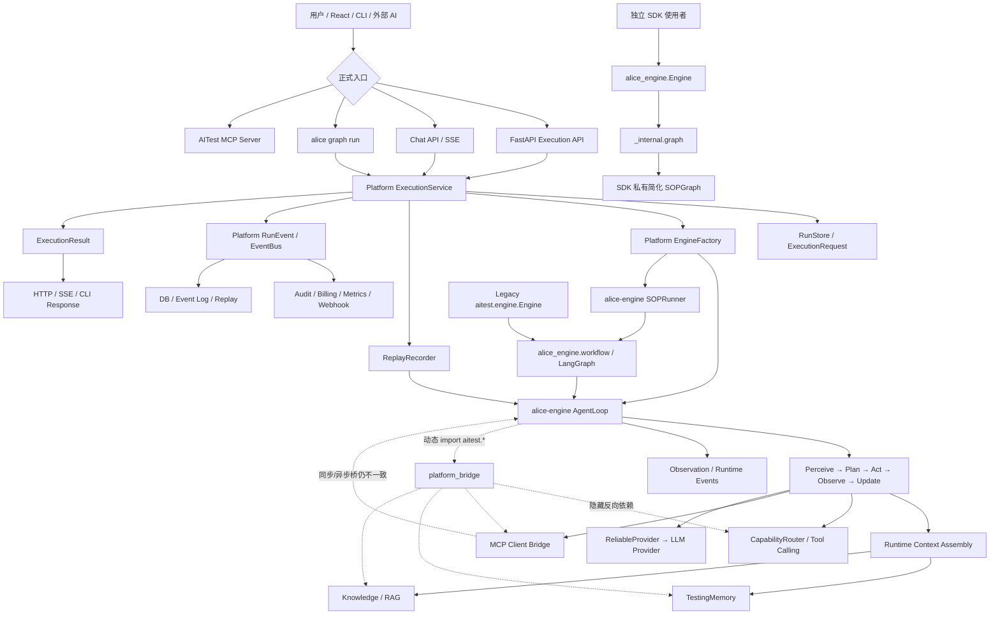

# Principal AI Engineer 第一阶段架构尽调

> 首次评估：2026-07-06  
> 改造后复审：2026-07-06  
> 评估对象：当前工作区快照  
> 说明：本文保留首次评估的八部分框架，并依据 Phase 1–6 改造后的代码、测试收集结果和架构文档更新结论。

## 结论先行

AITest 当前最准确的架构定位已经从：

> 一个正在拆包、尚未形成稳定执行内核的 Agent Native 模块化单体

演进为：

> 一个已经建立官方执行主链、并将 Capability、Memory、Knowledge、Replay、Audit 和恢复机制接入主流程的 Agent Native 模块化单体；但发布基线、依赖边界和唯一执行真相仍未完全收口，尚不能视为企业级稳定平台。

本轮改造取得了真实进展：

- 已用 `OFFICIAL_EXECUTION_MAINLINE.md` 固化 `Entry → ExecutionService → EngineFactory → Runtime/Workflow → Capability/Context → Provider → Event/Audit/Replay → Result`。
- `alice graph run` 已改为通过 `ExecutionService` 执行，不再使用独立 CLI Engine。
- Server Execution API 与 Chat 的主要执行入口已开始共享 `ExecutionService`。
- `EngineFactory` 已具备注册表，并统一创建 `AgentLoop` 或 `SOPRunner`。
- CapabilityRouter 默认启用；Tool Calling、Memory、Knowledge 与 Replay Recorder 已进入 `AgentLoop`。
- Replay 已从孤立模型推进到 `ExecutionService → AgentLoop` 自动录制。
- API 已增加组织、Workspace 和 Scope 校验，原有明显跨租户查询风险得到实质缓解。
- 已增加 Scheduler/Lease、ExecutionWorker、幂等、超时、崩溃恢复、Operational Metrics、Performance Baseline 和 Ecosystem Snapshot。
- 大量旧实现已删除或改成 SDK 兼容转发，`alice-engine` 已成为主要 Runtime/Workflow 代码承载者。

但必须准确理解“完成”的含义：

- Phase 1–6 Backlog 标记为 `Done`，表示对应小任务已落地，不表示 V1–V4 平台目标已经完成。
- Platform 官方主链已经建立，但公共 SDK `alice_engine.Engine` 仍执行 `_internal.graph`；问题不在于它没有调用 Platform `ExecutionService`，而在于 Platform 与 SDK 尚未共同依赖同一个可发布执行内核。
- `aitest.engine.Engine` 旧实现仍存在，虽然当前主 CLI 已不再使用它。
- 全量测试收集仍有 7 个导入错误；发布基线不是绿色。
- Docker 镜像仍未复制或安装 `packages/alice-engine`，生产镜像存在启动阻断风险。
- 静态依赖图中 16 个一级包位于同一强连通分量，目录分层尚未成为真实依赖 DAG。
- `platform/` 已增长到约 1.4 万行，平台层正在成为新的集成型 God Package。

因此本轮改造后的核心判断是：

> 平台已经跨过“只有架构概念、主链没有接通”的阶段，进入“Platform 主链已接通，但 SDK 执行内核、平台编排契约、发布和依赖边界尚未收口”的阶段。

当前优先级也随之变化：不应继续证明“能力存在”，而应证明“所有正式入口语义一致、测试可收集、镜像可运行、边界可执行、失败可观测”。

当前工作树包含大量已修改、删除和未跟踪文件。本报告评估的是当前快照，不等同于已提交、可复现的发布版本。

------

# 一、项目整体架构

## 1.1 目标架构

当前更合理的目标不是让 SDK 进入 Platform，而是让 Platform 和 SDK 共同依赖 SDK 内的执行内核：

```text
Platform API / CLI / Chat                Standalone SDK Consumer
            ↓                                      ↓
Platform ExecutionService                     alice_engine.Engine
            ↓                                      ↓
Tenant / Run / Audit / Queue Adapter     Standalone Configuration
            └──────────────┬───────────────────────┘
                           ↓
             alice-engine Execution Kernel
                           ↓
        Runtime Executor / Workflow / Graph Registry
                           ↓
       Capability / Context / Provider / Tool Ports
                           ↓
          Memory / Knowledge / Replay / Event Hooks
                           ↓
                  SDK ExecutionResult
                           ↓
      Platform projection or standalone RunResult
```

同时坚持：

- Platform ≠ Project。
- `.tlo/` 是项目上下文和可移植资产边界。
- Governance mandatory。
- Capability over Tool。
- Runtime 推进执行状态，Graph 只负责编排。
- Server、CLI、Chat 和 SDK 不应重新实现执行内核；Platform 可以在 SDK 结果之外增加租户、持久化、审计和调度语义。
- `alice-engine` 不静态依赖 `aitest`。
- `alice-engine` 也不应通过动态导入把 `aitest` 变成事实上的可选 Service Locator。
- Platform 依赖 SDK，SDK 通过 Port 接收 Platform Adapter；依赖方向不能反转。

目标方向是正确的，且比首次评估时更具体：它已经从抽象分层图变成了可用于 PR Review 的官方约束。

## 1.2 当前真实架构



这张图说明当前平台已经形成一条主要执行链，但还不是严格的单链系统：

1. CLI Graph、Execution API、Chat 的主要入口已经向 `ExecutionService` 收敛。
2. `ExecutionService` 通过 `EngineFactory` 选择 `AgentLoop` 或 `SOPRunner`。
3. SOP Graph 的节点最终调用 AgentLoop，核心循环集中在 `alice-engine`。
4. Capability、Memory、Knowledge 和 Replay 已进入 AgentLoop，而不是仅存在旁路代码。
5. SDK `Engine` 仍使用 `_internal.graph`，Platform 则通过自己的 `EngineFactory` 调用 SDK 的 `AgentLoop/SOPRunner`；两者没有共享一个公开、稳定的 Execution Kernel API。
6. 旧 `aitest.engine.Engine` 仍在仓库中，是兼容路径和认知负担。

## 1.3 主运行流程

### Platform 正式执行流程

1. CLI、HTTP 或 Chat Adapter 构造 `ExecutionContext`。
2. `ExecutionService` 规范化 module、pages、agent、mode、provider。
3. 校验 `execute` Scope，并创建 `ExecutionRequest` 和 `Run`。
4. 先持久化状态，再发布生命周期事件。
5. `EngineFactory` 从 Registry 解析执行器。
6. SOP 请求进入 `SOPRunner → LangGraph → AgentLoop`；单 Agent 请求直接进入 `AgentLoop`。
7. AgentLoop 执行 `Perceive → Plan → Act → Observe → Update`。
8. Runtime Context Assembly 查询 TestingMemory 与 Knowledge。
9. CapabilityRouter 暴露允许的 Tool，LLM Tool Calling 触发 Provider/MCP/本地能力。
10. ReliableProvider 执行模型调用、重试和 Fallback。
11. ReplayRecorder 记录 Step 与 LLM Call。
12. RunEvent、Observation、Audit、Billing、Metrics 和 Webhook 消费执行事件。
13. `ExecutionResult` 统一表达成功、失败、取消、阶段结果和 Replay 关联信息。
14. Adapter 将结果映射为 CLI、HTTP 或 SSE 输出。

### SOP 流程

1. `SOPRunner` 创建并恢复 `SOPState`。
2. Workflow Registry/Builder 构建 LangGraph。
3. Preflight 与路由函数选择下一 Phase。
4. Graph Node 调用对应 AgentLoop。
5. HITL 节点可中断并等待用户。
6. Gate 决定继续、重试、升级或退出。
7. Checkpoint 保存图状态。
8. `ExecutionService` 将 Workflow 状态归一为平台 `ExecutionResult`。

### 当前关键偏差

- SDK `alice_engine.Engine.run()` 仍通过 `alice_engine._internal.graph.build_sop_graph()` 执行；这条路径与 Platform 使用的 `AgentLoop/SOPRunner` 不是同一个公开执行内核。
- **SDK 不应复用 Platform `ExecutionService`。** `ExecutionService` 负责 Scope、Tenant、RunStore、幂等、队列、平台事件和审计，是 AITest 应用层能力；让 SDK 调用它会破坏独立发布和依赖方向。
- 正确收敛方向是：从当前 SDK 与 `aitest/platform` 中识别并固化 `ExecutionKernel/RuntimeExecutor`，由 `alice_engine.Engine` 和 Platform `ExecutionService` 分别作为 Standalone Facade 与 Platform Facade 调用。
- SDK 与 Platform 可以共享 `ExecutionContext` 的执行字段和核心 `ExecutionResult`，但租户、队列、Billing、平台审计、持久化状态不应被强塞进 SDK 语义。
- `aitest.engine.Engine` 仍直接构建 Workflow，是遗留入口；当前正式 CLI 已不调用它，但代码和测试仍需维护。
- `alice_engine.platform_bridge.create_mcp_clients_for_agent()` 以同步方式调用异步 MCP Client 工厂，实际返回值契约不一致，MCP 主链仍不能视为验证完成。
- Observation 发送失败仍可能被宽泛捕获后静默忽略，可观测性不满足“关键事件不可静默丢失”的冻结目标。

结论：

> 已经存在 Platform 官方主链和主要入口收敛；下一步不是让 SDK 依赖 Platform，而是建立“一个 SDK 执行内核、两个应用 Facade”。CLI、Server、Chat 应共享 Platform Facade，独立 SDK 使用 Standalone Facade，两者共享核心执行语义。

------

# 二、一级模块职责分析

| 模块 | 模块职责、输入与输出 | 主要依赖 | 改造后边界判断 |
|---|---|---|---|
| Engine / Runtime | 输入 Agent、Module、Page、Provider 和 Execution Context；输出 AgentState、AgentEvent、ExecutionResult | Workflow、Skill、Provider、显式 Port | 核心代码已向 `alice-engine` 集中；仍缺公开 Execution Kernel，且动态 Platform Bridge 污染 SDK 独立性 |
| Graph / Workflow | 定义 Phase、Node、Edge、Gate、HITL、Checkpoint | AgentLoop、LangGraph、State | 旧 Graph 文件大量移除并迁入 SDK；职责更清楚，但 State、Gate、Artifact 规则仍偏集中 |
| Platform | Run、ExecutionService、Event、Tenant、Plugin、Memory、Capability、Replay、Scheduler、Metrics | Engine、Infra、Knowledge、MCP、Discovery | 约 68 个文件、1.4 万行；已成为平台集成中心，也是最高 God Package 风险 |
| Knowledge | Markdown Source of Truth、索引、检索、RAG、知识服务 | `.tlo`、ChromaDB、Platform Paths | 已接入 Runtime Context；`platform.knowledge` 与 `knowledge` 域仍有重复和双向依赖 |
| Governance | Agent、Skill、Phase、Validator、Behavior Pack、领域规则 | YAML/Markdown、alice-governance | 独立包方向正确；兼容导出和加载源尚未完全绿色 |
| LLM | Provider 兼容、Prompt、上下文、Retry/Fallback、流式响应 | Config、Tracing、Provider | 大量实现已迁入 SDK；`aitest.llm` 与 SDK Provider 仍共同存在 |
| Provider | Claude/OpenAI/DeepSeek/MiMo/Ollama/Mock 的注册与调用 | 外部模型 SDK | Registry 和统一 Response 已改善；名称、配置与 Streaming Contract 仍需统一 |
| Audit | Run 审计、在线监控、代码审计、日报、SOP 优化、成本 | EventBus、DB、文件、audit_engine | 能力丰富，但 Platform Audit 与 `audit_engine` 仍是两个边界模糊的分析域 |
| Replay | Step/LLM/Tool 录制、Session、回放、事件关联 | Execution Kernel、ExecutionService、RunEvent、Store | 已正式接入执行；纯回放模型/Port 与平台 SQL 存储仍耦合在 `aitest.platform.replay` |
| CLI | Project、Graph、Server、Doctor、Ecosystem、TUI | ExecutionService、Platform、Infra | `graph run` 已收口主链；旧 `commands/run.py` 和旧 Engine 仍形成遗留面 |
| MCP | 对外 MCP Server；对内连接外部 MCP Server | MCP SDK、Tool Registry、Platform Bridge | Client 已使用 `AsyncExitStack` 管理会话，但 SDK Bridge 同步/异步契约有缺陷 |
| Memory | Agent 临时状态、TestingMemory、向量存储、命中指标 | ChromaDB、Observation、Context Builder | 已进入 Prompt/Runtime Context 主链；失败仍大量降级为空，可靠性与租户隔离需加强 |
| Infrastructure | SQLite/PG、SQL、Queue、Security、Logging、Metrics、Webhook | OS、DB、Redis/RQ | 能力完整度提高，但实际存在 `infra → platform` 导入，违反冻结依赖规则 |
| Scheduler / Worker | Job、Lease、Heartbeat、Dispatch、Retry、Recovery | Queue、RunStore、Tenant | 已有领域模型和专项测试；距离持久化分布式调度控制面仍有差距 |
| Frontend | React、Zustand、SSE、WebSocket、Execution/Observability/Ecosystem UI | Server API | 产品面较完整；测试覆盖和 API Contract 自动校验仍弱 |
| Discovery | 项目、页面、后端能力发现及 Registry | alice-discovery、Platform | 已开始独立 package 化；旧路径清理造成兼容测试未完全同步 |

## God Module 风险

当前风险排序：

1. `aitest/platform/`：约 68 个文件、1.4 万行，同时承担应用服务、领域模型、存储、事件、Memory、Knowledge 桥、Capability、Replay、Scheduler 和企业控制面。
2. `alice_engine/core/executor.py`：约 1400 行，承担 AgentLoop 初始化、Provider、Capability、MCP、Memory、Knowledge、Replay、Continuation、执行循环和清理。
3. `aitest/server/api/execution.py`：已超过 900 行，混合 Command、Query、Debug、Audit、Report、Billing 和 Webhook API。
4. `audit_engine/`：约 5700 行，包含在线监控、审查、归因、日报、优化等多个子域。
5. Workflow State/SOP Nodes：仍集中承载 Phase 状态、Artifact 规则、Gate 和路由语义。

改造后 God Module 风险没有消失，而是从“多个平行实现”部分转移为“Platform 和 Executor 过度集成”。

------

# 三、依赖分析

## 3.1 形式规则与实际遵守情况

冻结文档规定：

```text
server/api → platform → infra → runtime
                ↓
            alice-engine
```

并禁止：

- `infra → platform`
- `platform → server`
- `alice-engine → aitest`

当前静态事实：

- `platform → server`：未发现，是健康边界。
- `alice-engine → aitest`：未发现静态 import，是拆包成功点。
- `infra → platform`：实际存在，冻结规则已被违反。
- SDK 虽无静态反向依赖，但 `platform_bridge.py` 通过字符串动态加载 `aitest.*`，形成可选但隐藏的运行时依赖。

因此不能再写成“三条规则均已遵守”。真实状态是：一条守住、一条静态守住但存在 Bridge、一条已经被突破。

## 3.2 真实依赖环

按当前 Python 静态 import 计算，以下 16 个一级包位于同一个强连通分量：

```text
adapters
agents
audit_engine
bu_adapter
config
discovery
graphs
graphs_dev
infra
integrations
knowledge
llm
mcp
platform
runtime
testing
```

主要直接双向依赖：

- `platform ↔ infra`
- `platform ↔ runtime`
- `platform ↔ agents`
- `platform ↔ knowledge`
- `platform ↔ discovery`
- `platform ↔ mcp`
- `adapters ↔ audit_engine`
- `adapters ↔ llm`

首次评估是 13 个一级包处于同一 SCC；当前变为 16 个。这并不意味着所有改造都退步，而是说明“代码搬迁和能力接线”先于“依赖倒置和边界清理”。下一阶段必须把依赖图纳入 CI，而不能只靠目录和文档表达分层。

## 3.3 强耦合与隐藏依赖

### 全局环境状态

`ENGINE_WORKSTUDY`、`ENGINE_GOVERNANCE`、`LLM_PROVIDER`、`MOCK_LLM`、活跃项目仍通过进程环境变量传播。SDK Engine 和遗留 Engine 初始化都会修改环境变量。

影响：

- 同进程多项目/多租户执行可能互相覆盖。
- 并行 Run 的 Provider、Project 和 Governance 上下文隔离不足。
- 测试顺序可能影响结果。
- 分布式 Worker 必须在派发时显式序列化 Run-scoped Context。

### 单例与隐式 Service Locator

EventBus、RunStore、AuditLogger、WorkspaceManager、TenantManager、PluginManager、CapabilityRouter 等仍提供 singleton fallback。`app.state` DI 已改善 Server 路径，但核心和兼容路径仍会绕回全局 getter。

### 动态 Platform Bridge

`alice-engine` 使用 `import_module("aitest....")` 动态接入 Capability、MCP、Memory 和 Knowledge。

它让最小安装暂时不报 ImportError，但不能据此认定 SDK 已真正独立。代价是：

- 静态依赖检查看不到真实耦合。
- 接口不匹配只能在运行时暴露。
- 当前 MCP 的 async 工厂被同步 Bridge 调用就是直接例证。
- SDK 行为会因为运行环境中是否“碰巧安装 aitest”而变化，破坏可预测性。

这一层不应继续扩张。目标应是由调用方显式注入 `CapabilityProvider`、`ToolProvider`、`MemoryStore`、`KnowledgeStore`、`ReplaySink` 等 Port；AITest 在自己的 Composition Root 中装配实现。若保留自动发现，也应下沉为版本化 Entry Point 插件机制，而不是硬编码 `aitest.*` 字符串。

### 文件与状态契约

仍同时存在：

- `.tlo/knowledge/modules`
- `.tlo/runtime/sop-status`
- Checkpoint DB
- Platform RunStore
- `governance/.data`
- Artifact/Replay/Event 文件

`.tlo` 作为项目资产边界是正确的，但运行状态仍有多个权威来源。恢复策略已经增加，状态归属问题尚未彻底解决。

### Dict Contract

`SOPState`、ToolCall、Artifact Metadata 和部分 Event Data 仍大量使用动态字典。RunEvent 已增加 Key 常量和 Schema，但兼容与生产路径并未全部强校验。

### 跨层调用

Capability Provider 和 Platform Bridge 会直接触达 Agent、Discovery、MCP、Knowledge 和 Memory。它们事实上是 Adapter/Composition Root，却位于 Platform/Core 内部，导致应用层与基础设施适配层交叉。

## 3.4 共享状态风险

- Workflow 路径和 Behavior Pack 仍有进程级配置。
- Provider、CircuitBreaker、EventBus 和 Agent Definition 存在缓存。
- Tenant 使用量部分仍在内存，Run/Audit/Billing 则持久化。
- Chat Session 同时涉及内存、SQLite 和前端状态。
- Scheduler Lease 已建模，但尚未证明跨多实例、网络分区和进程重启下的一致性。

结论：单机模块化单体可继续演进，但尚未具备严格的多进程一致性基础。

------

# 四、架构范式评估

| 范式 | 已做得好的地方 | 当前提升空间与风险 |
|---|---|---|
| SOLID | Protocol、Registry、dataclass、构造注入和公开 `cancel()` 已增加 | Platform、Executor、Execution API、Audit 仍职责过宽；Bridge 接口缺显式类型契约 |
| Clean Architecture | Platform 入口逐步向应用服务收敛；SDK 未静态导入 aitest | 16 包循环依赖；`infra → platform`；SDK 仍通过动态导入反向感知 Platform |
| DDD | Agent、Skill、Phase、Run、ExecutionRequest、Artifact、Module、Workspace 语言稳定 | Knowledge、Memory、Audit、Replay、Scheduler 的 bounded context 和数据所有权仍未完全明确 |
| Hexagonal | ExecutionEngine、Provider、KnowledgeStore、MemoryStore、CapabilityProvider、Extension Contract 都是有效 Port | Composition Root 分散；Platform Bridge 仍依赖字符串导入和软失败 |
| 插件化 | Provider Registry、Engine Registry、Workflow Registry、Extension Contract、Ecosystem Snapshot 已形成 | 缺统一 Plugin API 版本、依赖解析、权限沙箱、生命周期和兼容性门禁 |
| 事件驱动 | RunEvent、Consumer、指标、Billing、Audit、Trace、Replay 已进入正式链路 | 多套 EventBus 并存；关键 Observation 仍可静默失败；缺统一重试/DLQ/Outbox |
| Agent Engineering | PPAOU、ReliableProvider、Continuation、Skill、HITL、Capability Tool Calling、Memory/Knowledge Context、Replay 均有接线 | MCP Bridge 仍有契约错误；真实模型/工具端到端验证不足；Context 降级过于安静 |
| Capability Based | Router 默认启用，Tool Calling 已进入 Skill 执行，能力映射可发现 | 未声明 Agent 仍可获得全部能力，属于 fail-open；企业治理必须转为 fail-closed |
| State Machine | Run、Request、Job、Lease、Task、LangGraph 状态均明确，崩溃恢复已有实现 | 状态机数量多；RunStore、Checkpoint、SOP_STATUS、Replay、内存状态仍需明确单一权威关系 |
| 模块化 | alice-engine、alice-governance、alice-discovery 的拆包方向成立 | 兼容导出未清干净；全量测试收集失败；真实依赖没有形成 DAG |

总体判断：

> 架构概念已经开始转化为运行能力，但“能力接线完成度”高于“契约收敛度、边界健康度和发布可信度”。

------

# 五、项目健康度

评分标准：10 为企业生产级稳定状态。

| 维度 | 首次评分 | 当前评分 | 评分依据 |
|---|---:|---:|---|
| 架构健康度 | 5.0 | 6.0 | Platform 主链、冻结规则和 Registry 已建立；公开 SDK 内核缺失、动态 Bridge 和依赖环仍在 |
| 模块划分 | 5.0 | 5.2 | SDK 拆包更清晰，但 16 包 SCC 与 Platform 膨胀抵消收益 |
| 复杂度 | 3.5 | 4.2 | 旧实现大量删除，但主链集成后 Executor/Platform 更复杂 |
| 可维护性 | 4.5 | 5.2 | 契约和专项测试增加；兼容导出与旧入口仍需同步维护 |
| 扩展性 | 5.5 | 7.0 | Engine/Workflow/Provider/Extension/Capability Registry 已具备真实扩展点 |
| 可测试性 | 4.5 | 5.0 | 测试数量增加到 1121 项，但全量仍无法完成收集 |
| 稳定性 | 3.0 | 4.5 | 恢复、幂等、租户校验、指标已补；构建、镜像和测试门禁仍阻断 |
| 未来演进能力 | 6.5 | 7.5 | 主链、`.tlo`、SDK 和平台契约方向正确，具备继续收敛的基础 |

综合健康度：**5.7/10**（首次为 4.7/10）

这一分数表达的是：

- 架构方向和平台能力明显进步。
- 当前快照仍不是可宣称“企业生产就绪”的版本。
- 最大差距已经从“没有能力”转为“能力没有被统一契约和发布证据证明”。

## 可复现证据

- 当前 `aitest` 非测试 Python 代码约 309 个文件、59606 行；其中 `platform/` 为 68 个文件、约 14034 行。
- 全量 pytest 收集：发现 1121 项，但有 7 个 ImportError，无法进入完整执行。
- 7 个收集错误集中在拆包后的兼容导出不同步：
  - `AUTOMATION_ARTIFACT_RULES`
  - `DEV_AGENT_SKILL_MAP`
  - `emit_cache_summary`
  - `PageResult`
  - `load_skill`
  - `_lineage`
  - `compute_backoff`
- 工作区 `.venv` 启动器当前无法创建进程；替代 Python 环境又缺少 `chromadb` 或 editable package，说明开发环境本身也尚未可复现。
- Dockerfile 仍只复制 `aitest/`、`governance/` 和 `docs/`，没有安装 `alice-engine`、`alice-governance`、`alice-discovery` workspace package。

------

# 六、技术债分析

## Critical

### C1. 发布与验证基线不绿色

- 问题：全量测试有 7 个收集错误，`.venv` 不可正常启动，镜像未安装 workspace packages。
- 根因：拆包、兼容清理、依赖安装和 CI/镜像更新没有作为同一个原子发布工作完成。
- 影响：无法证明当前 Phase 1–6 组合状态可重复运行。
- 未来风险：本地部分测试通过，但 CI、容器或新开发机直接失败。
- 建议方向：把“新环境安装 → 全量 collect → 核心测试 → 镜像 build → 容器 health”设为 P0 发布门禁。

### C2. 执行真相仍未完全统一

- 问题：CLI/Server/Chat 已主要收敛到 Platform `ExecutionService`，但 SDK Engine 仍走 `_internal.graph`，Platform `EngineFactory` 又直接选择 `AgentLoop/SOPRunner`，遗留 Engine 仍可直接执行 Workflow。
- 根因：收敛的是 Platform 入口，没有先在 SDK 内固化公开 Execution Kernel；同时为接入平台能力引入了动态 `platform_bridge`。
- 影响：同一任务在 Standalone SDK 与 Platform 中的 Workflow 选择、Capability、Memory、Knowledge、Replay 和错误语义可能不同。租户、Billing 等差异则是合理的平台增量，不能误判为 SDK 缺陷。
- 未来风险：形成“Platform 内核”和“SDK 简化内核”两个长期实现，SDK 无法稳定独立发布。
- 建议方向：在 `alice-engine` 定义并实现共享 Execution Kernel、Engine Registry 和显式 Runtime Ports；Platform `ExecutionService` 只负责编排平台生命周期并调用该内核，SDK `Engine` 直接调用该内核。

### C3. 依赖边界与架构冻结不一致

- 问题：16 个一级包形成同一 SCC，且实际存在 `infra → platform`。
- 根因：能力接线直接使用具体实现，Composition Root 和 Port 没有同步抽离。
- 影响：模块无法独立测试、替换或拆分，改动传播范围持续扩大。
- 未来风险：Platform 变成所有模块都能调用、也被所有模块调用的 God Package。
- 建议方向：建立自动依赖门禁，先消除 `infra ↔ platform` 和 `runtime ↔ platform`，再逐域拆 SCC。

## High

### H1. MCP 主链契约仍有运行时错误

- 问题：MCP Client 工厂是 async，SDK Platform Bridge 按同步函数调用并立即解包。
- 根因：跨 package Port 没有显式 async Contract 和契约测试。
- 影响：AgentLoop MCP 初始化会软失败，工具目录为空。
- 未来风险：平台显示支持 MCP，但真实 Agent 无法稳定调用。
- 建议方向：统一异步生命周期 Port，并增加真实 stdio/http MCP Contract Test。

### H2. Capability 权限仍是 fail-open

- 问题：未配置能力映射的 Agent 可以获得全部能力，现有测试也固化了该行为。
- 根因：兼容优先于最小权限。
- 影响：新增或拼错 Agent ID 时可能意外获得高权限工具。
- 未来风险：企业多租户与插件生态下形成越权执行。
- 建议方向：开发模式可显式告警，生产模式必须 fail-closed。

### H3. 关键事件仍可能静默丢失

- 问题：Observation 和部分 Bridge 调用使用宽泛 `except Exception` 后降级为空或直接 `pass`。
- 根因：以“不影响主流程”为最高目标，没有区分业务增强事件与合规关键事件。
- 影响：Memory、Audit、Replay 和指标可能与真实执行不一致。
- 未来风险：故障只表现为数据缺失，无法追责或回放。
- 建议方向：定义 Critical/Best-effort 事件等级；关键事件失败必须进入可观测错误通道。

### H4. PostgreSQL 与多实例路径缺少完整证据

- 问题：代码已有统一 SQL、PG、Checkpoint PG 和迁移能力，但当前没有可复现的双后端全链测试证据。
- 根因：数据库能力与当前损坏的测试/环境基线耦合。
- 影响：SQLite 单机成功不能证明 PG 多用户成功。
- 未来风险：并发、事务、参数绑定和恢复在生产才暴露。
- 建议方向：SQLite/PG Contract Suite、迁移测试和容器化 Integration Gate。

### H5. Platform 与 Executor 继续膨胀

- 问题：Platform 约 1.4 万行；Executor 约 1400 行。
- 根因：每个 Phase 都把新能力接入主链，但缺少后续职责下沉。
- 影响：Review 难、测试替换难、任何改动都可能跨域。
- 未来风险：官方主链变成新的单体瓶颈。
- 建议方向：保持 Platform Facade 稳定，把通用 Context Assembly、Tool Runtime、Replay Hook、Engine Registry 下沉到 SDK；Tenant/Run/Audit Lifecycle Coordinator 留在 Platform。

## Medium

### M1. Replay 已接线但尚非确定性回放

- 已记录 Step 与 LLM Call，但 Tool、副作用、Artifact、Provider 版本和外部系统快照还不足以保证确定性。

### M2. Memory/Knowledge 以软降级为主

- 主链已经查询并注入，但 Store 不可用、Schema 不匹配或查询异常时通常只记录 warning，缺少质量 SLO。

### M3. 状态权威源仍不唯一

- RunStore、Checkpoint、SOP_STATUS、Replay Session 和内存 AgentState 的恢复优先级需要正式状态所有权文档。

### M4. EventBus 家族仍碎片化

- Platform RunEvent、Observation、SDK EventBus、Legacy Engine EventBus 与 Trace 的 Envelope 和可靠性语义不同。

### M5. Plugin/Ecosystem 仍主要是控制面快照

- 已能发现项目、版本和扩展，但缺插件沙箱、依赖解析、签名、权限声明与版本升级策略。

### M6. API 职责过宽

- `server/api/execution.py` 同时处理执行、查询、调试、审计、报表、Billing、Webhook，Command/Query 边界不清。

### M7. 前端测试和 Contract 测试不足

- UI 已展示 Execution、Observability 和 Ecosystem 信息，但自动化覆盖不足以保护 SSE/WS/API 演进。

### M8. 多租户从“明显越权”改善到“企业隔离未完成”

- API 已有组织与 Workspace 校验；Knowledge、Memory、Artifact、Cache、Scheduler 和动态 Bridge 的租户命名空间仍需系统验证。

## Low

- 文档版本、Phase `Done`、架构 Freeze 与代码实际状态存在语义漂移。
- 旧 `commands/run.py`、旧 Engine 和兼容模块仍增加认知负担。
- Provider 名称仍混用 `claude`、`anthropic` 等不同语义。
- 宽泛异常、软失败和历史注释较多。
- 当前工作树变更量过大，不利于审计每个 Small PR 的真实边界。

------

# 七、扩展能力成本

定义：**1 = 成本很低，10 = 成本很高**。

| 扩展项 | 首次成本 | 当前成本 | 改造后原因 |
|---|---:|---:|---|
| 新增 Agent | 6 | 5 | SDK Agent Definition 和 Engine Registry 已集中，但 Governance/Capability/Graph/UI 仍需协调 |
| 新增 Skill | 4 | 3 | Skill/Behavior Pack 模式成熟；需确保 Registry、版本和 Owner 完整 |
| 新增 Graph | 8 | 6 | Workflow 已迁入 SDK并有 Registry；仍涉及 State、Checkpoint、SSE、Gate |
| 新增 Provider | 6 | 4 | SDK Provider Registry、统一 Response、Retry/Fallback 已具备 |
| 新增 Memory 类型 | 6 | 4 | Store、Context Assembly 和命中指标已接线；仍需 Schema/租户/生命周期 |
| 新增 Knowledge 类型 | 7 | 5 | `.tlo` SoT 和 Runtime 查询链清晰；索引、Namespace、RAG/MCP 仍复杂 |
| 新增 Runtime | 9 | 7 | Engine/Workflow Port 已出现，但 SDK/Platform 双 Facade 和全局状态仍限制替换 |
| 新增 Governance | 6 | 5 | 独立 package 与 Behavior Pack 已建立；兼容加载源尚未彻底收口 |
| 新增 Replay | 8 | 5 | Recorder/Player 已进入主链；确定性副作用回放和版本契约仍昂贵 |
| 新增 Audit | 6 | 4 | RunEvent Consumer 和 Extension Contract 已形成；需选择 Platform Audit 或 audit_engine 边界 |
| 新增 Capability | 7 | 4 | Router、Provider 和 Tool Calling 已进入主链；权限必须从 fail-open 改为 fail-closed |
| 新增 Tool | 7 | 5 | Capability Tool Contract 已形成；本地 Tool 与 MCP async 生命周期仍需统一 |
| 新增 Scheduler | 8 | 6 | Job/Lease/Heartbeat/Recovery 已建模；持久化、分布式锁和多实例一致性仍昂贵 |

总体变化：多数扩展项下降 1–3 分，说明本轮改造确实提高了平台可扩展性。新增 Runtime、Graph 和 Scheduler 仍是高成本能力，不应在当前收口完成前并行扩张。

------

# 八、未来演进路线

## V1：可信发布基线与 SDK 执行内核收口

当前状态：**部分完成，尚未验收通过。**

已完成：

- 官方执行主链文档与架构冻结。
- CLI Graph、Execution API、Chat 主要入口向 Platform ExecutionService 收敛。
- ExecutionContext、ExecutionResult、Engine Registry、Workflow Registry 基线。
- Capability、Memory、Knowledge、Replay 主链接线。
- 租户访问校验、指标、恢复和专项测试文件。

尚需完成：

- 修复 7 个测试收集错误并恢复全量绿色门禁。
- 修复 workspace 安装与 `.venv` 可复现性。
- 更新 Docker/CI，实际安装并验证三个 workspace packages。
- 在 SDK 内建立公开 Execution Kernel；让 SDK Engine 与 Platform ExecutionService 都依赖该 Kernel。
- 逐步移除 SDK 对 `aitest.*` 的动态 Platform Bridge，改为显式 Port 注入。
- 明确并弃用遗留 Engine/Graph 入口。
- 建立 Kernel Contract Test，以及 Platform Facade/Standalone Facade 的核心语义等价测试；平台特有的租户、持久化和审计字段单独验证。

V1 完成标准不是文档标记，而是：

```text
standalone SDK clean install
+ platform workspace install
+ full test collection
+ core regression green
+ image build and health green
+ kernel contract equivalence
```

## V2：可治理的模块化单体

当前状态：**已经启动，约完成能力接线层，边界治理尚未完成。**

目标：

- 将 Platform/Executor 中已接入的能力拆成稳定 Port。
- 消除核心循环依赖。
- 统一 Tool/MCP、Event、Context 和 State Contract。

重点：

- 首先切断 `infra ↔ platform`、`runtime ↔ platform`。
- 用显式注入和版本化插件 Entry Point 替代 Platform Bridge。
- MCP 改为一致的 async 生命周期。
- Capability 生产模式 fail-closed。
- Event Envelope 分级，关键事件不可静默丢失。
- 明确 RunStore、Checkpoint、SOP_STATUS、Replay 的状态所有权。
- Plugin 增加 API Version、权限和依赖声明。

保持兼容：

- `.tlo`。
- Agent/Skill ID。
- Run/Event/ExecutionResult 公共字段。
- REST/SSE 端点。

## V3：企业控制平面与分布式执行

当前状态：**已有局部基础，不具备全面进入条件。**

已有基础：

- Org/Workspace/Scope 校验。
- PG/SQLite 双后端代码。
- Scheduler Job、Lease、Heartbeat。
- ExecutionWorker、幂等与崩溃恢复。
- Operational Metrics、Trace、Audit、Billing。

进入条件：

- V1 发布基线绿色。
- V2 核心依赖环完成第一轮拆除。
- PG Contract Suite 通过。
- Run-scoped Context 替代进程环境变量。
- Outbox/Inbox、幂等消费、DLQ 和租约恢复有集成测试。
- Knowledge/Memory/Artifact/Cache 全部具备租户 Namespace。

新增能力：

- Durable Queue/Event Broker。
- Worker 注册、租约、心跳、取消和恢复。
- RBAC/ABAC、Secrets、Quota、Policy-as-Code。
- 持久化 Scheduler。
- 企业审计留存和数据生命周期。

## V4：Agent 平台生态

当前状态：**Ecosystem Snapshot 已建立观察入口，生态能力仍属未来。**

目标：

- 多 Runtime、多 Workflow、插件市场、离线评估和大规模治理。

新增能力：

- Runtime SPI 与非 LangGraph Runtime。
- Workflow Compiler/Designer。
- Agent、Skill、Provider、Tool Marketplace。
- 插件签名、兼容性、权限与隔离。
- Federated Knowledge。
- Replay Diff、离线评估、Shadow Run。
- 多区域和高可用控制平面。

保持兼容：

- Runtime SPI。
- Versioned Event、Artifact、Plugin Contract。
- Governance Pack。
- `.tlo` 可移植边界。

主要风险仍然是：生态扩张快于 Contract 治理。

------

# 九、SDK 独立发布与能力归属分析

## 9.1 独立发布结论

`alice-engine` 应当能够在没有安装 `aitest`、没有 AITest 数据库、没有 FastAPI、没有租户系统、没有平台目录结构的环境中独立安装和执行。

因此依赖方向必须是：

```text
alice-engine
    ↑
可选协议适配包（alice-engine-mcp / browser / chroma 等）
    ↑
aitest Platform
```

禁止形成：

```text
alice-engine → aitest.platform.ExecutionService
alice-engine → 动态 import aitest.*
alice-engine → AITest DB / Tenant / Server / governance 固定目录
```

这里需要区分两类“一致性”：

- **必须一致的核心语义**：Workflow 选择、AgentLoop、状态迁移、Provider/Tool 调用、Checkpoint、取消、Retry、核心事件、核心结果。
- **允许不同的平台增量语义**：Org/Workspace、Scope、RunStore、异步 Job、幂等请求、Billing、Webhook、平台 Audit、运营指标和 UI Projection。

SDK 不调用 `ExecutionService` 并不是架构偏差。真正的偏差是：SDK 与 `ExecutionService` 下面没有共用一个公开、稳定、可测试的执行内核。

## 9.2 建议的包级结构

```text
alice-engine
├── api
│   ├── Engine / AsyncEngine
│   ├── ExecutionContext
│   └── ExecutionResult
├── kernel
│   ├── ExecutionKernel
│   ├── EngineRegistry
│   ├── Lifecycle
│   └── Cancellation
├── workflow
│   ├── Graph / SOPRunner / State / Checkpoint Port
│   └── WorkflowRegistry
├── agent
│   ├── AgentLoop / Planner / Skill Runtime
│   └── Context Assembly
├── ports
│   ├── LLMProvider / ToolProvider / CapabilityProvider
│   ├── MemoryStore / KnowledgeStore
│   ├── ReplaySink / EventSink / CheckpointStore
│   └── ArtifactStore
└── adapters
    └── 仅保留零外部基础设施依赖的内存或文件实现

alice-engine-mcp        # 可选协议包
alice-engine-browser    # 可选浏览器 Runtime/Tool 包
alice-engine-chroma     # 可选 Knowledge/Memory Store
alice-governance        # Agent/Skill/Policy/Behavior Pack

aitest
├── platform            # 应用服务与企业控制面
├── server / cli        # 入口适配
├── infra               # SQL、Queue、Telemetry
└── composition         # 将平台 Adapter 注入 alice-engine
```

`ExecutionService` 应保留在 `aitest`。它调用 SDK 的 `ExecutionKernel`，并在调用前后管理平台 Run 生命周期。`alice_engine.Engine` 是独立用户的轻量 Facade，也调用同一 Kernel。

## 9.3 当前 `aitest` 中应抽取到 SDK 的能力

“抽取”不等于原文件整体移动。优先抽取纯模型、协议、状态机和算法，把 SQL、租户、目录、Web、队列实现留在 Platform Adapter。

| 当前能力/位置 | SDK 归属建议 | Platform 保留内容 | 优先级 | 判断依据 |
|---|---|---|---:|---|
| `aitest/platform/engine_factory.py` | 将 `ExecutionEngine` Protocol、Engine Registry、标准 Agent/SOP Factory 下沉到 `alice-engine.kernel` | 仅保留基于平台配置选择 Kernel、注入平台 Adapter 的 Factory | P0 | Runtime 实现选择属于执行内核；当前 Platform Factory 直接构造 SDK 类，边界倒置 |
| `aitest/platform/capability_router/router.py` | 抽取 `ToolDef`、`ToolCall`、`ToolResult`、`CapabilityContract`、Router 核心算法和 Provider Port | Agent 权限映射、企业 Policy、平台 Provider 注册、租户授权 | P0 | Tool/Capability 是独立 Agent Runtime 的基本能力，不应依赖 AITest |
| `aitest/platform/replay.py` | 抽取 `ExecutionStep`、`LLMTrace`、Replay Session 模型、Recorder/Player Port、纯回放匹配算法 | SQL Repository、Run 查询、租户隔离、保留策略、平台 Replay API/UI | P0 | Replay 是执行可重复性的内核能力；当前文件直接依赖 `aitest.infra.sql`，需拆 Core 与 Adapter |
| `aitest/platform/testing_memory.py` | 抽取通用 `MemoryRecord`、Memory Lifecycle、Signal/Observer Port；若 SDK 定位为 AI 测试 SDK，可保留 UI Pattern/Locator/Failure 等测试 Memory Schema | 租户 Namespace、运营统计、平台 Memory Consumer | P1 | Memory 参与上下文与决策，属于 Runtime；企业数据治理属于 Platform |
| `aitest/platform/testing_memory_store.py` | Store Protocol 进入 SDK；InMemory/File 实现可随 SDK 发布 | Chroma/PG 持久化实现、索引运维和租户隔离留平台或独立 `alice-engine-chroma` | P1 | 不能让核心 SDK 强依赖 ChromaDB 或平台数据目录 |
| `aitest/platform/preflight.py` | 抽取 Preflight Pipeline、Check Result、Check Protocol | AITest Artifact 规则、`.tlo` 具体路径、平台 Policy 和 UI 报告 | P1 | 执行前检查是 Runtime 生命周期能力，具体检查项是项目/平台规则 |
| `aitest/platform/complexity/` | 抽取评分器接口、路由策略和通用因子模型，或并入 SDK Complexity Extension | 企业阈值、租户配额、AITest 特定因子配置 | P1 | 复杂度会影响 Workflow 选择，属于可插拔执行策略 |
| `aitest/llm/` 中 Provider、Retry、Context Window、Circuit Breaker 重复实现 | 以 `alice-engine.providers/runtime` 为唯一实现；`aitest.llm` 仅做限期兼容导出后删除 | API Key/Secret 解析、租户模型白名单、用量计费 Adapter | P0 | Provider 是 SDK 的核心 Port 与默认 Adapter，双实现会产生行为漂移 |
| `aitest/graphs/`、`aitest/runtime/`、`aitest/engine/executor.py` 的兼容层 | 已在 SDK 存在的 Workflow/Checkpoint/Executor 以 SDK 为唯一真相 | 仅保留有明确弃用周期的 import shim | P0 | 这些目录多数已经是转发层，不应继续承载新行为 |
| `aitest/agents/skill_executor.py` 及通用 Agent/Skill 执行逻辑 | 通用 Agent Definition、Skill Loader/Registry/Executor、状态更新进入 SDK 或 `alice-governance` | 平台 Agent 目录、Owner、租户授权、运营配置 | P1 | 独立 SDK 必须能定义和运行 Agent/Skill |
| `aitest/audit_engine/` 中 Safety、Failure Attribution、Cost、Step Efficiency | 运行时安全检查、失败归因接口、成本/步骤采样作为 SDK Hook，重实现可放可选包 | 合规审计日志、日报、Billing、组织报表、SOP 运营优化 | P2 | “影响本次执行控制”的审计属于 Runtime；“面向组织经营”的审计属于 Platform |
| `aitest/mcp/mcp_client.py` 中通用 MCP Client 生命周期 | 不放入核心 SDK；抽为可选 `alice-engine-mcp`，实现 SDK `ToolProvider` | AITest MCP Server、平台 Tool 暴露、租户权限和配置 | P1 | MCP 是协议 Adapter，不是 Engine Core；必须正确表达 async 生命周期 |
| `aitest/platform/runtime.py` 中 Browser Runtime 抽象 | Runtime/Browser Port 可进入 SDK；Selenium/Remote Browser 实现放 `alice-engine-browser` | 浏览器资源池、远程会话、租户配额和平台运维 | P2 | 浏览器是可选执行环境，不能成为核心安装依赖 |
| `aitest/platform/knowledge.py` | `KnowledgeStore` Protocol、Query/Document 模型、InMemory 实现进入 SDK（已有部分基础，应统一） | Chroma 持久化、Namespace 管理、索引任务、RAG API/UI | P1 | Knowledge Context 属于 Runtime；知识基础设施属于 Adapter/Platform |

## 9.4 明确不应进入 SDK 的能力

以下能力必须留在 `aitest`，不能为了“统一主链”塞进 `alice-engine`：

| 能力 | 保留原因 |
|---|---|
| `ExecutionService` | Platform Application Service，负责 Scope、幂等、Run 生命周期、平台事件和结果投影 |
| `ExecutionRequest`、`Run`、`RunStore`、Query Layer | 平台控制面与持久化模型，不是独立执行内核的前置条件 |
| Organization、Workspace、Tenant、Ownership | 企业多租户业务语义 |
| Scheduler、ExecutionWorker、Lease、Recovery | 分布式平台控制面；SDK 只需 Cancellation/Checkpoint/Resume Port |
| Platform EventBus、Billing、Webhook、Operational Metrics | 平台运营与集成能力；SDK 只发布中立 Runtime Event |
| Audit Log、报表、UI Projection、Timeline API | 合规和产品展示层 |
| FastAPI、React、Chat Session、SSE/WS | 传输与产品入口 |
| SQL、Redis/RQ、数据库迁移 | 基础设施 Adapter |
| Plugin Marketplace/Ecosystem 控制面 | 平台治理；SDK 只定义插件契约和版本协商接口 |
| AITest MCP Server Tools | 平台对外暴露面；通用 MCP Client 应在可选适配包 |

## 9.5 当前 SDK 独立发布的真实阻断项

### P0 阻断

1. **没有公开的统一 Execution Kernel。** `alice_engine.Engine` 使用 `_internal.graph`，Platform 使用自己的 Factory 调用 `AgentLoop/SOPRunner`。
2. **动态 Platform Bridge。** SDK 在运行期硬编码加载 `aitest.platform`、`aitest.mcp` 和 `aitest.knowledge`；这不是可靠插件机制。
3. **进程环境变量承载 Run Context。** Engine 初始化写入 `ENGINE_WORKSTUDY`、`LLM_PROVIDER`、`MOCK_LLM`，独立库在同进程多实例下不可隔离。
4. **发布验证链缺失。** 必须在一个完全没有安装 `aitest` 的 clean environment 中安装 wheel 并运行 SDK Contract Suite。
5. **公开 API 与私有实现不一致。** 核心 `Engine.run()` 依赖 `_internal.graph`，私有模块事实上成了公共行为根基。

### P1 阻断

1. Capability、MCP、Memory、Knowledge 的装配依赖软失败，安装成功不等于能力可用。
2. Tool/MCP 同步与异步生命周期没有统一 Contract。
3. SDK Event 与 Platform RunEvent/Observation/Replay Envelope 没有清晰映射规范。
4. 默认 Governance/Behavior Pack、`.tlo` 与普通 Project 的最小目录契约需要版本化。
5. Provider extra、最低依赖和可选 Adapter 的兼容矩阵尚未形成发布门禁。

## 9.6 独立发布的验收标准

首个可信 SDK Release 至少满足：

```text
1. 在未安装 aitest 的全新 Python 3.11/3.12 环境安装 alice-engine wheel
2. import alice_engine 不触发平台、数据库、浏览器或 MCP 依赖
3. Engine 与 Platform ExecutionService 调用同一个公开 ExecutionKernel
4. Mock Provider + InMemory Ports 可完成最小 Agent 和 Workflow 执行
5. 两个 Engine 实例并行运行时不通过环境变量串扰 Context
6. Capability / Memory / Knowledge / Replay 均可通过显式 Port 注入
7. MCP、Browser、Chroma 缺失时行为由 feature/extra 明确表达，而非静默降级
8. SDK wheel Contract Test、API Compatibility Test、Semantic Version Gate 通过
9. aitest 只单向依赖 SDK；SDK 源码和 wheel 均不存在 aitest import 或字符串动态加载
10. Platform 特有的 Tenant/Audit/Billing 测试与 Kernel Contract Test 分离
```

## 9.7 建议的抽取顺序

抽取应采用 Strangler 方式，每一步都保持 Platform 可运行：

1. 先定义 SDK `ExecutionKernel` 和 Port，不移动平台业务代码。
2. 让 `alice_engine.Engine` 从 `_internal.graph` 切到 Kernel。
3. 让 Platform `EngineFactory/ExecutionService` 调用同一 Kernel，保持现有 Platform API 不变。
4. 将 Capability Contract/Router Core 下沉，平台权限映射作为 Adapter 注入。
5. 拆 Replay Core 与 SQL Repository，再拆 Memory/Knowledge Core 与 Store Adapter。
6. 用显式依赖注入替换 `platform_bridge`，最后删除动态 `aitest.*` 加载。
7. 将 MCP、Browser、Chroma 形成可选适配包，分别验证安装矩阵。
8. 清理 `aitest.engine/graphs/runtime/llm` 兼容层，并按 SemVer 发布 SDK。

这个顺序的关键是：先建立可替代的公开内核，再迁移调用方；不能先删除 Platform 能力，也不能把整个 `platform/` 搬进 SDK。

------

# 最终判断

这一轮改造是有效的，而且解决了首次评估中相当一部分“能力只存在于旁路”的问题。

最明显的提升是：

- 官方主链从建议变成了冻结文档和真实代码路径。
- CLI/Server/Chat 开始共享 Platform ExecutionService。
- Capability、Memory、Knowledge、Replay 不再只是孤立模块。
- 租户校验、Scheduler、恢复、Metrics 和 Ecosystem 已有可审查实现。
- SDK 拆包方向更加明确。

但当前仍不能宣布“架构收敛完成”，因为四个硬门槛尚未通过：

1. 全量测试不能完整收集。
2. 容器构建没有安装核心 workspace packages。
3. SDK 与 Platform 尚未共享公开 Execution Kernel，且 SDK 仍有动态 Platform Bridge。
4. 真实依赖图仍是大型循环分量。

所以，改造后的平台不再是“概念很多、主链没接通”，而是：

> Platform 主链已经接通，下一步必须把其下方的执行能力固化成独立、可发布、可证明、可治理的 SDK Kernel。

下一阶段最重要的关系应改写为：

```text
CLI / Server / Chat
        ↓
Platform ExecutionService
        ↓
alice-engine ExecutionKernel
        ↑
Standalone alice_engine.Engine

Replay 验证围绕 ExecutionKernel 建立，
Tenant / Audit / Billing 围绕 Platform Facade 建立。
```

与首次评估相比，Platform 三个主要入口已经基本进入同一应用服务，Capability、Memory 和 Replay 也已经真实挂载。剩余工作不应继续横向堆能力，也不应要求 SDK 反向复用 Platform；应优先完成 SDK Kernel、显式 Port、独立 wheel 验证、依赖解环和关键契约测试。

本次复审仅编辑了本文档，没有修改业务代码。
