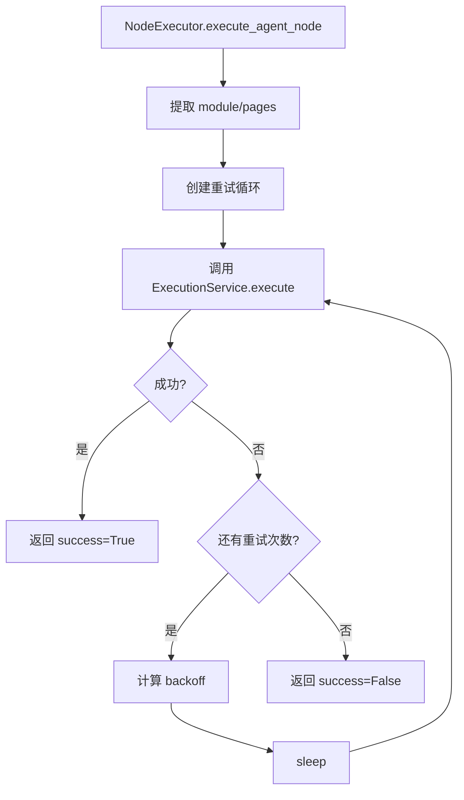

# Workflow Executor 设计文档

> **创建时间**: 2026-07-10  
> **状态**: ✅ 实现完成  
> **相关任务**: P8-1 Workflow 执行引擎

## 架构概览

```
POST /api/v1/runs
  ↓
RunExecutor.execute_workflow()
  ↓
WorkflowExecutor
  ├─ build_graph() → LangGraph StateGraph
  ├─ NodeExecutor (agent/human_gate/condition/parallel)
  └─ execute() → 返回结果

WorkflowRuntime
  ├─ node_outputs: Dict[node_id, output]
  ├─ completed_nodes: List[node_id]
  └─ 状态传递
```

## 核心组件

### 1. WorkflowExecutor

**职责**: 从 WorkflowGraph JSON 构建 LangGraph 并执行

**方法**:
- `build_graph()`: 将 JSON 转换为 StateGraph
- `execute()`: 编译并执行图
- `_make_node_func()`: 为每个节点创建执行函数
- `_make_route_func()`: 为条件边创建路由函数
- `_find_entry_nodes()`: 找入口节点（无入边）
- `_find_exit_nodes()`: 找出口节点（无出边）

### 2. NodeExecutor

**职责**: 节点执行器工厂，根据 node.type 分发

**支持的节点类型**:

| 类型 | 执行逻辑 | 状态 |
|------|---------|------|
| `agent` | 复用 ExecutionService，支持 retry_policy | ✅ 完整实现 |
| `human_gate` | 返回 default_action（WebSocket 推送待实现） | ⚠️ 基础版 |
| `condition` | 简单表达式求值（eval） | ✅ 完整实现 |
| `parallel` | 占位（未来使用 Send() API） | ⚠️ 占位 |

### 3. WorkflowRuntime

**职责**: 运行时状态管理

**字段**:
- `run_id`: 执行 ID
- `workflow_id`: 工作流 ID
- `ctx`: ExecutionContext
- `params`: 输入参数（module/pages/input）
- `runtime_config`: 运行时配置（provider/mode）
- `node_outputs`: 节点输出缓存
- `completed_nodes`: 已完成节点列表

**方法**:
- `get_node_output()`: 获取上游节点输出
- `set_node_output()`: 保存节点输出
- `to_state()`: 转换为 WorkflowState（LangGraph 状态）

### 4. RetryHandler

**职责**: 节点重试逻辑

**支持的退避策略**:
- `none`: 不退避
- `linear`: 线性退避（1s, 2s, 3s...）
- `exponential`: 指数退避（1s, 2s, 4s, 8s...）

## 状态传递

### WorkflowState (LangGraph State)

```python
class WorkflowState(TypedDict):
    run_id: str
    workflow_id: str
    node_outputs: Dict[str, Any]      # {node_id: output}
    current_node: str
    completed_nodes: List[str]
    error: Optional[str]
    metadata: Dict[str, Any]
```

### 节点输出格式

#### agent 节点
```python
{
    "success": True,
    "run_id": "run_xxx",
    "status": "completed",
    "error_message": None
}
```

#### human_gate 节点
```python
{
    "success": True,
    "action": "approved",  # or "rejected"
    "comment": "审核通过"
}
```

#### condition 节点
```python
{
    "success": True,
    "result": True  # or False
}
```

## 条件路由

### 边的 condition 字段

| condition 值 | 含义 | 示例 |
|--------------|------|------|
| `always` | 无条件执行 | 直接边 |
| `approved` | human_gate 审核通过 | HITL 后继续 |
| `rejected` | human_gate 审核拒绝 | HITL 后终止 |
| 自定义表达式 | Python 表达式 | `node_outputs['req']['success']` |

### 路由函数实现

```python
def route_func(state: WorkflowState) -> str:
    upstream_output = state["node_outputs"][edge.from_node]
    
    if edge.condition == "approved":
        return edge.to_node if upstream_output["action"] == "approved" else END
    
    # 自定义表达式
    result = eval(edge.condition, {"node_outputs": state["node_outputs"]})
    return edge.to_node if result else END
```

**安全性**: 使用受限的 `eval()`，仅允许访问 `node_outputs`

## Agent 节点执行流程



**重试逻辑**:
- 外层重试：WorkflowExecutor 根据 retry_policy
- 内层不重试：ExecutionService 的 max_retries=1

## 图构建算法

### 入口节点检测
```python
def _find_entry_nodes(self) -> List[str]:
    all_nodes = {node.node_id for node in self.workflow.nodes}
    nodes_with_incoming = {edge.to_node for edge in self.workflow.edges}
    return list(all_nodes - nodes_with_incoming)
```

### 出口节点检测
```python
def _find_exit_nodes(self) -> List[str]:
    all_nodes = {node.node_id for node in self.workflow.nodes}
    nodes_with_outgoing = {edge.from_node for edge in self.workflow.edges}
    return list(all_nodes - nodes_with_outgoing)
```

**规则**:
- 入口节点 → `set_entry_point()`
- 出口节点 → `add_edge(node_id, END)`

## 集成到 RunExecutor

### execute_workflow() 流程

```python
1. 加载 Workflow 定义（WorkflowStore）
2. 创建 Run 记录（RunStore）
3. 创建 WorkflowRuntime
4. 执行 WorkflowExecutor.execute()
5. 更新 Run 状态（completed/failed）
6. 返回结果
```

### 返回格式

```python
{
    "run_id": "run_xxx",
    "status": "completed",
    "error_message": None,
    "artifacts": [],
    "metrics": {
        "duration_ms": 12000,
        "tokens_used": 0,  # TODO: 聚合所有 Agent 节点
        "cost_usd": 0.0
    },
    "workflow_result": {
        "completed_nodes": ["req", "design", "automation"],
        "node_outputs": {
            "req": {"success": True, ...},
            "design": {"success": True, ...},
            ...
        }
    }
}
```

## 未来改进

### 1. Human Gate WebSocket 推送

**当前**: 返回 `default_action`  
**目标**: WebSocket 推送到 Studio，等待用户审核

```python
# TODO: 实现
async def execute_human_gate_node(...):
    # 1. 推送到 WebSocket
    await websocket.send_json({
        "type": "human_gate",
        "run_id": runtime.run_id,
        "node_id": node.node_id,
        "prompt": node.prompt,
        "timeout_seconds": node.timeout_seconds,
    })
    
    # 2. 等待响应（带超时）
    response = await asyncio.wait_for(
        websocket.receive_json(),
        timeout=node.timeout_seconds
    )
    
    # 3. 超时则返回 default_action
    return response or {"action": node.default_action}
```

### 2. Parallel 节点并行执行

**当前**: 串行执行  
**目标**: 使用 LangGraph Send() API

参考: `aitest/graphs/parallel_sop.py`

```python
from langgraph.constants import Send

def execute_parallel_node(...):
    parallel_nodes = node.metadata.get("parallel_nodes", [])
    return [Send(node_id, state) for node_id in parallel_nodes]
```

### 3. Workflow 断点续传

**当前**: 每次全新执行  
**目标**: 支持从中断点恢复

```python
# WorkflowRuntime 持久化
def resume_workflow(run_id: str):
    runtime = load_runtime(run_id)
    executor = WorkflowExecutor(workflow, runtime)
    executor.execute(resume=True)
```

### 4. Token/Cost 聚合

**当前**: metrics 返回 0  
**目标**: 聚合所有 Agent 节点的 token 使用和成本

```python
def aggregate_metrics(node_outputs: Dict[str, Any]) -> Dict:
    total_tokens = sum(
        output.get("tokens_used", 0)
        for output in node_outputs.values()
        if output.get("success")
    )
    return {"tokens_used": total_tokens, ...}
```

## 测试计划

### 单元测试

1. `test_workflow_executor_build_graph()`: 图构建
2. `test_node_executor_agent()`: Agent 节点执行
3. `test_node_executor_condition()`: 条件节点
4. `test_retry_handler()`: 重试逻辑

### 集成测试

1. 创建简单 Workflow（2 个 agent 节点）
2. 通过 POST /api/v1/runs 执行
3. 验证 Run 状态和 node_outputs

### 端到端测试

1. 创建复杂 Workflow（包含 human_gate + condition）
2. 执行并验证条件路由
3. 验证重试逻辑（模拟 Agent 失败）

## 相关文件

- `aitest/platform/workflow_executor.py`: 核心实现
- `aitest/server/api/run_executor.py`: RunExecutor 集成
- `aitest/platform/workflow.py`: WorkflowGraph 数据模型
- `aitest/platform/workflow_store.py`: Workflow CRUD
- `docs/MASTER_ROADMAP.md`: P8-1 任务
