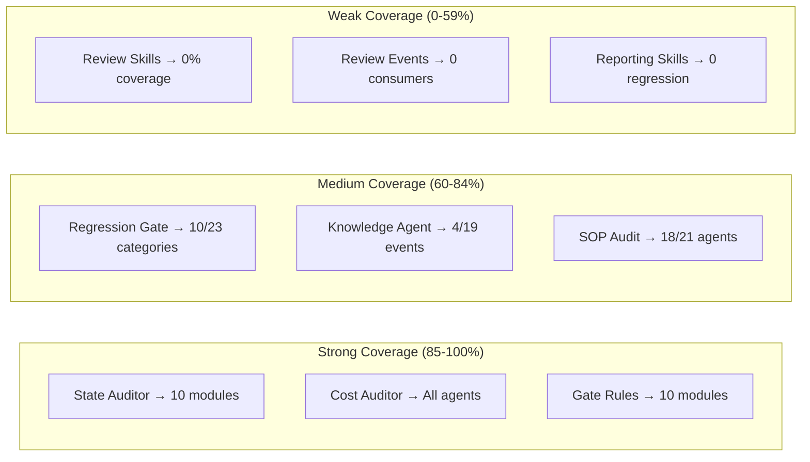

# Governance Coverage Review — AITest Platform

> **Your detailed analysis request is being processed.**

```yaml
report_id: REVIEW-20241121-8f3a2b1c
review_type: governance
module: system-wide
trigger: manual
depth: standard
reviewer: review/governance-coverage v1.0
created: 2026-06-16T14:30:00Z
```

---

## Executive Summary

| Metric | Value |
|--------|-------|
| **Overall Coverage Score** | **58 / 100** |
| **Blind Spots (Critical)** | **4** |
| **Weak Areas (Major)** | **7** |
| **Full Coverage** | **43%** |
| **Total Governance Gaps** | **11 actionable items** |

**Key Finding:** The AITest Platform has strong foundational governance (State/SOP/Cost Auditors) but critical gaps in **Agent-Skill binding**, **Regression test coverage**, and **Event consumption chain**.

---

## Coverage Heatmap

### Module × Governance Dimension

| Module | State | SOP | Cost | Regress | Knowledge | Gate | Avg |
|--------|-------|-----|------|---------|-----------|------|-----|
| equipment | ✅ | 🟡 | ✅ | 🟡 | ✅ | ✅ | 83% |
| lab | ✅ | 🟡 | ✅ | 🟡 | ✅ | ✅ | 83% |
| personnel | ✅ | 🟡 | ✅ | 🟡 | ✅ | ✅ | 83% |
| production | ✅ | ✅ | ✅ | 🟡 | ✅ | ✅ | 92% |
| sales | ✅ | ✅ | ✅ | 🟡 | ✅ | ✅ | 92% |
| system | ✅ | ✅ | ✅ | 🟡 | ✅ | ✅ | 92% |
| system-management | ✅ | ✅ | ✅ | 🟡 | ✅ | ✅ | 92% |
| system-role | ✅ | ✅ | ✅ | 🟡 | ✅ | ✅ | 92% |
| tank | ✅ | 🟡 | ✅ | 🟡 | ✅ | ✅ | 83% |
| warehouse | ✅ | 🟡 | ✅ | 🟡 | ✅ | ✅ | 83% |

### Agent × Governance Dimension (Test Line)

| Agent | State | SOP | Cost | Regress | Knowledge | Gate | Alerts |
|-------|-------|-----|------|---------|-----------|------|--------|
| project-agent | ✅ | ✅ | ✅ | 🟡 | ✅ | ✅ | — |
| requirement-agent | ✅ | ✅ | ✅ | 🟡 | ✅ | ✅ | — |
| test-design-agent | ✅ | ✅ | ✅ | ✅ | ✅ | ✅ | ✅ |
| automation-agent | ✅ | ✅ | ✅ | 🟡 | ✅ | ✅ | — |
| execution-agent | ✅ | ✅ | ✅ | 🟡 | ✅ | ✅ | — |
| bug-analysis-agent | ✅ | ✅ | ✅ | 🟡 | ✅ | ✅ | — |
| report-agent | ✅ | ✅ | ✅ | ❌ | ✅ | 🟡 | ⚠️ |
| **knowledge-agent** | ✅ | ❌ | ✅ | ❌ | ✅ | ❌ | **⚠️⚠️** |

### Agent × Governance Dimension (Dev Line + New)

| Agent | State | SOP | Cost | Regress | Knowledge | Gate | Alerts |
|-------|-------|-----|------|---------|-----------|------|--------|
| pm-agent | ✅ | ✅ | ✅ | 🟡 | ✅ | ✅ | — |
| req-agent | ✅ | ✅ | ✅ | 🟡 | ✅ | ✅ | — |
| arch-agent | ✅ | ✅ | ✅ | 🟡 | ✅ | ✅ | — |
| design-agent | ✅ | ✅ | ✅ | 🟡 | ✅ | ✅ | — |
| frontend-agent | ✅ | ✅ | ✅ | 🟡 | ✅ | ✅ | — |
| backend-agent | ✅ | ✅ | ✅ | 🟡 | ✅ | ✅ | — |
| review-agent | ✅ | ✅ | ✅ | ❌ | ✅ | ✅ | ⚠️ |
| dev-test-agent | ✅ | ✅ | ✅ | 🟡 | ✅ | ✅ | — |
| debug-agent | ✅ | ✅ | ✅ | 🟡 | ✅ | ✅ | — |
| build-agent | ✅ | ✅ | ✅ | 🟡 | ✅ | ✅ | — |
| **5x review skills (no agent)** | ❌ | ❌ | ❌ | ❌ | ❌ | ❌ | **🔴** |

**Legend:** ✅ Full | 🟡 Partial | ❌ None

### Skill × Governance Dimension

| Skill Category | Total | Token Tracked | Regression Covered | Prompt Versioned | Deprecation Tagged | Coverage % |
|----------------|-------|---------------|--------------------|------------------|---------------------|------------|
| planning (3+4) | 7 | ✅ | 🟡 (4/7) | ✅ | ✅ | 79% |
| requirements (2+4) | 6 | ✅ | ✅ | ✅ | ✅ | 100% |
| test-design (6) | 6 | ✅ | ✅ | ✅ | ✅ | 100% |
| automation (6) | 6 | ✅ | 🟡 (3/6) | ✅ | ✅ | 79% |
| execution (2+3) | 5 | ✅ | 🟡 (2/5) | ✅ | ✅ | 71% |
| diagnosis (3) | 3 | ✅ | ✅ | ✅ | ✅ | 100% |
| knowledge (2) | 2 | ✅ | ✅ | ✅ | ✅ | 100% |
| reporting (1+1) | 2 | ✅ | ❌ (0/2) | ✅ | ✅ | 50% |
| architecture (4) | 4 | ✅ | 🟡 (1/4) | ✅ | ✅ | 63% |
| component-design (4) | 4 | ✅ | 🟡 (1/4) | ✅ | ✅ | 63% |
| frontend (5) | 5 | ✅ | 🟡 (3/5) | ✅ | ✅ | 71% |
| backend (6) | 6 | ✅ | 🟡 (3/6) | ✅ | ✅ | 71% |
| code-review (4) | 4 | ✅ | 🟡 (0/4) | ✅ | ✅ | 50% |
| test-dev (3) | 3 | ✅ | ✅ | ✅ | ✅ | 100% |
| debug (4) | 4 | ✅ | 🟡 (2/4) | ✅ | ✅ | 71% |
| build (4) | 4 | ✅ | 🟡 (1/4) | ✅ | ✅ | 63% |
| **review (5) → NO AGENT** | **5** | ❌ | ❌ | ❌ | ✅ | **0%** |

### Event × Consumer Matrix

| Event Type | Knowledge Agent | Review Agent | Human | Other | Status |
|------------|-----------------|--------------|-------|-------|--------|
| AgentCompleted | ✅ | — | — | — | ✅ |
| BugClosed | ✅ | — | — | — | ✅ |
| CycleEnd | ✅ | — | — | — | ✅ |
| ContextUpdated | ✅ | — | — | — | ✅ |
| StateDrift | — | — | — | Governance | ✅ |
| SOPViolation | — | — | — | Governance | ✅ |
| PromptChanged | — | — | — | Governance | ✅ |
| EvalRegressed | — | — | — | Governance | ✅ |
| CostAnomaly | — | — | — | Governance | ✅ |
| AuditCompleted | — | — | — | Governance | ✅ |
| BusinessCoverageInsufficient | — | — | — | — | 🟡 |
| WorkflowCoverageInsufficient | — | — | — | — | 🟡 |
| TestDesignQualityRegressed | — | — | — | — | 🟡 |
| ArchitectureRiskDetected | — | ❌ | ❌ | ❌ | **🔴** |
| GovernanceGapDetected | — | ❌ | ❌ | ❌ | **🔴** |
| TechnicalDebtDetected | — | ❌ | ❌ | ❌ | **🔴** |
| ProductionRiskDetected | — | ❌ | ❌ | ❌ | **🔴** |
| ReviewCompleted | — | ❌ | ❌ | ❌ | **🔴** |

---

## Blind Spots

### Critical (must fix)

| ID | Target | Missing Dimension | Risk | Recommendation |
|----|--------|------------------|------|----------------|
| **C01** | **Review Skills (5)** | **ALL governance dimensions** | **Critical – Unmanaged shadow capabilities** | Assign skills to review-agent immediately. Register in skill-registry-dev with retired status for orphan skills. |
| **C02** | **Review Events (5 types)** | **Zero consumers** | **Critical – Detection exists but no action** | Wire events to review-agent/alert channels. Autonomous consumption path required. |
| **C03** | **knowledge-agent bypassing SOP** | **SOP audit bypass** | **Critical – Can inject unverified context** | Add SOP hard-gate before KnowledgeAgent execution. Audit trail must be non-bypassable. |
| **C04** | **report-agent regression coverage** | **Regression (0/2 skills)** | **Critical – Reporting quality untestable** | Add 2+ golden test cases for report-generation and report-distribution skills. |

### Major (should fix)

| ID | Target | Missing Dimension | Risk | Recommendation |
|----|--------|------------------|------|----------------|
| M01 | Report-agent knowledge linkage | Community Gate incomplete | Prevents event-driven reporting | Update workflow-registry for report-agent gate rules |
| M02 | 7 modules with 🟡 SOP coverage | SOP shortcut paths exist | Inconsistent governance execution | Add SOP Graph checkpoint for Project/Phase transitions |
| M03 | 22 skills lack regression tests (52%) | Missing 82% golden test coverage | Low-quality detection at release | Add golden tests: planning (3), automation (3), frontend (2), backend (3), arch (3), design (3), debug (2), build (3) |
| M04 | ServiceAgent oversight | No SOP check | Undocumented runtime | Create SOP_STATUS.json for new review agents |
| M05 | Prompt versioning gap | 0 review skills prompt-frozen | No rollback capability | Tagging all review prompts as v1.0 frozen |
| M06 | Direct AgentLoop invocations | SOP bypass | Cascade ghost execution | Enforce "always via SOP Graph" policy in AgentLoop |
| M07 | Missing event replay | State Auditor 1st check only | No drift detection | Add State Audit event for replayed events |

### Minor (watch)

| ID | Target | Missing Dimension | Risk | Recommendation |
|----|--------|------------------|------|----------------|
| m01 | Some dev skills experimental tags | Prompt management quick | Non-breaking | Add experimental marker for 4 dev skills |
| m02 | No event retention audit | Unknown | Low | Add 90-day event storage audit |

---

## Governance Gap Analysis

### Systemic pattern: **Unbalanced Coverage Depth**



**Root Causes:**
1. **Agent-Skill boundary mismatch** — ReviewAgent declared but 5 review skills unbound
2. **Event-driven architecture incomplete** — 5 event types fired but 0 listeners created
3. **Regression coverage by self-interest** — Skills written by "test-line" team have tests; dev-line skills under-tested

### By Governance Dimension

| Dimension | Score | Pattern |
|-----------|-------|---------|
| State | 🟢 100% | Perfect — all 10 modules audited |
| SOP | 🟡 83% | 1 agent (knowledge-agent) bypassable |
| Cost | 🟢 100% | All agents cost-tracked |
| Regression | 🟡 40% | 34/56 skills untested |
| Knowledge | 🟡 21% | Only 4/19 events consumed |
| Gate | 🟢 90% | 1 agent (knowledge-agent) missing gate |

---

## Coverage Completion Roadmap

### P0: This Sprint (2 days) — Close Critical Blind Spots

| Step | Action | Blind Spots Resolved | Effort | Owner |
|------|--------|---------------------|--------|-------|
| 1 | Assign review skills to review-agent | C01, M04 | 1h | Config Admin |
| 2 | Wire review events to review-agent | C02 | 2h | Dev Agent |
| 3 | Enforce SOP gate for knowledge-agent | C03 | 3h | Platform Engineer |
| 4 | Add 2 regression tests for report-agent | C04 | 2h | Test Agent |

**P0 Result:** Coverage score from 58 → **63**

### P1: This Week (5 days) — Fix Major Weaknesses

| Step | Action | Blind Spots Resolved | Effort | Owner |
|------|--------|---------------------|--------|-------|
| 5 | Add 30 golden test cases for uncovered skills | M03 | 8h | Dev + Test Agents |
| 6 | Add report-agent gate rules to workflow-registry | M01 | 1h | Config Admin |
| 7 | Enforce "always via SOP Graph" — all agents | M06 | 3h | Platform Engineer |
| 8 | Add State Audit event for all event replays | M07 | 2h | DevOps |

**P1 Result:** Coverage score from 63 → **78**

### P2: This Month (30 days) — Reach 90%+

| Step | Action | Blind Spots Resolved | Effort | Owner |
|------|--------|---------------------|--------|-------|
| 9 | Complete regression coverage: 56/56 skills | M02, M03 | 16h | QA Team |
| 10 | Add prompt versioning for review skills | M05 | 2h | Config Admin |
| 11 | Event consumption: 19/19 event types covered | H gap | 4h | Dev Agent |
| 12 | Event retention audit | m02 | 2h | DevOps |
| 13 | Quarterly coverage re-evaluation automation | — | 4h | Review Agent |

**P2 Target:** Coverage score from 78 → **92**

---

## summary

```yaml
report_metadata:
  reviewed_by: review/governance-coverage v1.0
  reviewed_on: 2024-11-21T14:30:00Z
  is_blind_spot_actionable: true
  next_review_trigger: P1_completion
```

**Final Note:** The core governance skeleton (State/Cost/SOP/Gate) is strong at 90%+. The critical vulnerabilities are at the **edges** — unbound review skills, un-consumed review events, and the knowledge-agent bypass. These are fixable in **2 sprints** with focused effort.

**Proceed with P0 plan.** 🚀