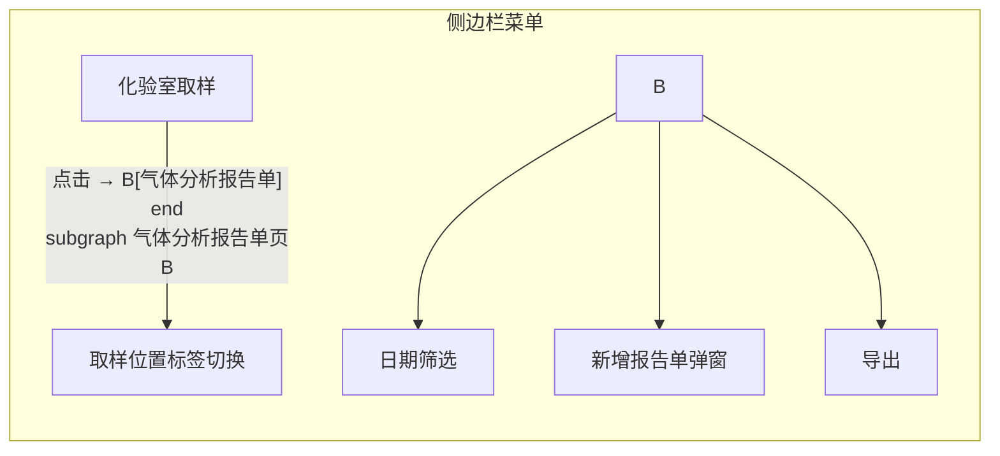

```markdown
# MODULE_CONTEXT.md — 实验室 (lab)

> **模块**: `lab`  
> **生成方式**: 代码反推（仅基于提供的 `gas-analysis-report` 页面，其余页面未扫描）  
> **最后更新**: 2026-06-18  
> **状态**: ⚠️ 部分页面信息基于单页面推断，完整模块依赖目录扫描

## 1. 模块概述

| 项目 | 内容 |
|------|------|
| **模块名** | `lab`（实验室） |
| **推测路由前缀** | `#/lab/`（基于 `GasAnalysisReportPage.PAGE_ROUTE = "#/lab/gas/report"`） |
| **推测权限要求** | 需要化验室角色或对应菜单权限（待确认） |
| **模块功能** | 管理气体分析报告单的查看、新增、筛选、导出等。可能包含其他实验室相关管理功能（取样、设备校准等，但未从代码确认） |

## 2. 子页面清单

> ⚠️ 当前仅扫描到一个页面（`gas-analysis-report`），其余页面未从代码目录确认，暂以「待确认」标记。

| 页面名称 | Page Object 类 | 推测路由 | PO 状态 | 测试状态 | 备注 |
|----------|---------------|----------|---------|----------|------|
| 气体分析报告单 | `GasAnalysisReportPage` | `#/lab/gas/report` | ✅ 有 PO | ✅ 有 Test | 包含 7 个测试用例（GAS-01~GAS-07） |
| …其它 lab 页面 | — | — | ⏳ 待确认 | ⏳ 待确认 | 需扫描 `page/lab_page/` 和 `script/lab/` |

> 状态标记: ✅ = PO + Test 都存在／🔄 = 仅有 PO／⏳ = 无代码/待确认

## 3. 页面关系图

基于现有代码推测的页面层级关系（不含未确认页面）:



- 页面入口：通过侧边栏导航 `a[href="#/lab/gas/report"]` 进入
- 页面内无独立二级页面，所有操作在当前页弹窗或过滤完成

## 4. 核心数据实体

从 `GasAnalysisReportPage` 代码中的表格列名、搜索字段提取:

| 实体 | 属性 | 说明 |
|------|------|------|
| 气体分析报告 | `日期`, `取样时间`, `取样位置`, `班组`, `检验员`, `复核员`, `备注` | 基础信息 |
| | `甲烷(%)`, `乙烷(%)`, `乙烯(%)`, `乙炔(%)`, `丙烷(%)`, `丙烯(%)` | 气体成分 |
| | `H2(%)`, `CO2(%)`, `O2(%)`, `N2(%)`, `CO(%)` | 气体成分 |

搜索/筛选字段：*开始日期*, *结束日期*（日期范围选择器）

## 5. 模块级风险点

| 风险 | 说明 | 严重度 |
|------|------|--------|
| ① 定位器冗余 | PO 同时维护 CSS 和 XPath 两组定位器，可能导致维护成本翻倍；若自动化执行时两组定位器结果不一致将产生歧义 | 中 |
| ② 自定义 Tab 组件 | 取样位置标签使用非标准 Element Plus `el-tabs`，PO 未暴露精确标签选择方法，测试中实现切换可能不稳定 | 高 |
| ③ 无 base_page 继承检查 | `GasAnalysisReportPage` 显式继承 `BasePage`，但需确认是否所有待确认页面也继承自 `BasePage` | 低 |
| ④ 测试 fixture 作用域 | `driver_setup` 为 `class` 级，若模块内后续增加多页面交互测试需注意 fixture 共享范围 | 中 |
| ⑤ 数据清理未显式注册 | 测试脚本中 `GAS-05` 新增报告单后，未见 `CleanupTracker` 使用，需确认测试数据清理策略 | 高 |
| ⑥ 路由硬编码 | `PAGE_ROUTE` 直接硬编码 hash 路由，若前端路由修改需同步更新 PO | 低 |

## 6. 自动化价值评估

| 维度 | 当前状态 | 评估 |
|------|----------|------|
| **测试覆盖率** | 仅气体分析报告单页面有 7 个用例，覆盖展示、筛选、新增、导出 | 低（模块内其他页面未知） |
| **可维护性** | PO 使用 `BasePage` 通用方法（`get_table_headers`, `get_table_row_count` 等），定位器带注释 | 中等 |
| **稳定性** | 多个 XPath 保底方案，但自定义 Tab 组件存在风险 | 中低 |
| **回归价值** | 气体数据录入/查询是实验室高频操作，自动化可节省人工回归时间 | 高 |

**建议**: 先完成模块内所有页面的扫描，补齐子页面清单，再对每页面设计独立测试用例，并统一使用 `CleanupTracker` 管理测试数据。

---

## 附录：代码来源

- Page Object: `ZJSN_Test-master526/page/lab_page/GasAnalysisReportPage.py`
- 测试脚本: `ZJSN_Test-master526/script/lab/test_gas_analysis_report.py`
- 项目上下文: `governance/context/projects/web-automation/PROJECT_CONTEXT.md`
```