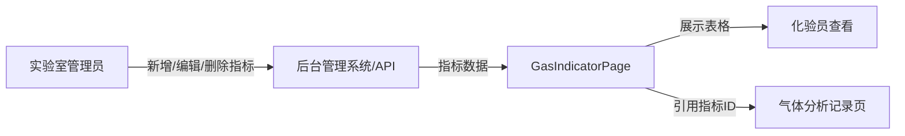

好的，作为 Web 端测试工程师，我将根据你提供的 `GasIndicatorPage.py`、`test_gas_indicator.py`、`PAGE_CONTEXT.md`（含技术分析）及项目基座上下文，为 `lab/gas-indicator` 页面输出风险模型（`RISK_MODEL.md`）和业务场景模型（`BUSINESS_SCENARIOS.md`）。

> **⚠️ 注意矛盾点**：`PAGE_CONTEXT.md` 描述页面为“纯展示/只读”，但 `GasIndicatorPage.py` 暴露了完整的 CRUD 操作（新增、弹窗表单、confirm），且注释称“标准 CRUD 表格”。这表明：  
> - 可能页面曾经包含 CRUD 功能，但当前已切换为只读；  
> - 或 CRUD 按钮仍在但受权限控制（如 admin 可见、普通用户不可见）。  
> 我的风险建模将同时覆盖展示场景和 CRUD 场景，并在业务场景中标注不确定性。

---

```markdown
# RISK_MODEL — lab / gas-indicator

> **版本**: 1.0 | **日期**: 2026-06-18  
> **分析依据**: `GasIndicatorPage.py`, `test_gas_indicator.py`, `PAGE_CONTEXT.md`, `Tech Analysis`  
> **注意**: 页面当前描述为只读，但 PO 包含 CRUD 操作，以下风险覆盖两种可能性。

---

## 1. 业务风险

| 风险ID | 风险描述 | 等级 | 影响 | 缓解措施 | 关联自动化覆盖 |
|--------|----------|------|------|----------|----------------|
| `RISK-BIZ-001` | 页面实际为只读，但 CRUD 按钮（新增指标）仍暴露给无写权限用户，用户点击后弹出空弹窗或 403，产生困惑 | **P1** | 影响用户信任，错误体验 | 1. 前端根据角色权限隐藏按钮<br>2. 接口返回 403 时前端弹出友好提示而非空白弹窗<br>3. 测试增加权限校验 | 未覆盖 |
| `RISK-BIZ-002` | 若 CRUD 已下线但数据需要维护，用户无法通过页面新增/编辑指标，只能通过后台，流程阻断 | **P0** | 阻塞业务（如需修改指标） | 建议在模块上下文文档中明确数据维护通道（如后台或 API） | 无 |
| `RISK-BIZ-003` | 表格中“设计值/标准范围”数据错误（如单位错误、阈值错误），将直接导致气体分析结果判断异常 | **P0** | 业务损失（分析结论不可靠） | 1. 数据写入前需多级审批（业务规则）<br>2. 测试中需抽样比对源数据 | 未覆盖（当前只测展示，未测数据准确性） |

---

## 2. 权限风险

| 风险ID | 风险描述 | 等级 | 影响 | 缓解措施 | 关联自动化覆盖 |
|--------|----------|------|------|----------|----------------|
| `RISK-PERM-001` | 无权限用户通过直接访问路由 `#/lab/gas/indicator` 看到页面，甚至调用 CRUD 接口 | **P0** | 数据泄露/越权操作 | 1. 路由守卫校验角色<br>2. 接口层校验权限<br>3. 测试增加正向/逆向权限用例 | 未覆盖 |
| `RISK-PERM-002` | 具备查看权限但无编辑权限的用户看到“新增指标”按钮，点击后弹窗无法操作（或 403 被吞） | **P1** | 体验问题 | 前端按权限渲染按钮（角色矩阵控制） | 未覆盖 |
| `RISK-PERM-003` | 管理员可删除指标，但删除后关联的气体分析记录引用的指标 ID 发生逻辑错误 | **P1** | 数据完整性问题 | 1. 删除做软删除或关联校验<br>2. 测试级联数据场景 | 未覆盖 |

---

## 3. 数据风险

| 风险ID | 风险描述 | 等级 | 影响 | 缓解措施 | 关联自动化覆盖 |
|--------|----------|------|------|----------|----------------|
| `RISK-DATA-001` | 指标名称/分类/单位/阈值字段在新增/编辑时未做数据边界校验，导致超长文本或特殊字符入库，后续展示错乱 | **P0** | 数据污染，UI 变形 | 1. 后端统一校验长度/类型<br>2. 前端做输入限制（如 maxlength）<br>3. 测试设计边界值、特殊字符用例 | 未覆盖（PO 中无校验方法） |
| `RISK-DATA-002` | 页面为纯展示，全量加载 23 行，若未来数据量增长（如 500+），无分页会导致 DOM 膨胀、页面卡顿 | **P1** | 性能问题 | 1. 后端应支持分页参数<br>2. 前端表格设置 `virtual-scroll` 或分页 | 未覆盖 |
| `RISK-DATA-003` | 相同指标名称重复录入（业务上应唯一），导致数据冗余，报表展示重复行 | **P1** | 数据一致性 | 后端唯一索引约束（指标名称+分类联合唯一） | 未覆盖 |
| `RISK-DATA-004` | 指标删除后，关联的“气体分析记录”中引用的指标 ID 变为空或 ORPHAN，导致历史数据分析异常 | **P1** | 数据完整性 | 1. 删除前校验关联业务表<br>2. 采用逻辑删除（is_deleted 字段） | 未覆盖 |

---

## 4. 接口风险

| 风险ID | 风险描述 | 等级 | 影响 | 缓解措施 | 关联自动化覆盖 |
|--------|----------|------|------|----------|----------------|
| `RISK-API-001` | 接口返回慢（>5s）或超时（如 504），前端无加载状态提示，用户误以为页面死掉 | **P1** | 用户体验差 | 1. 前端增加 loading 状态<br>2. 超时后显示重试提示 | 未覆盖 |
| `RISK-API-002` | 接口返回异常数据格式（如字段名变更、类型不符），前端渲染报错白屏 | **P0** | 核心功能不可用 | 1. 前端做数据容错（try-catch render）<br>2. 测试增加 mock 异常数据场景 | 未覆盖 |
| `RISK-API-003` | Token 过期后接口返回 401，前端未跳转登录页，停留在空白页 | **P1** | 体验问题 | 统一拦截 401 并跳转登录 | 未覆盖 |
| `RISK-API-004` | CRUD 接口（新增/编辑/删除）存在 SQL 注入风险 | **P0** | 安全漏洞 | 后端使用参数化查询，输入过滤 | 未覆盖 |

---

## 5. UI/UX 风险

| 风险ID | 风险描述 | 等级 | 影响 | 缓解措施 | 关联自动化覆盖 |
|--------|----------|------|------|----------|----------------|
| `RISK-UI-001` | 表格内容在 1366×768 分辨率下横向滚动异常，重要列被截断 | **P2** | 边缘场景，但影响查看 | 测试至少覆盖两种分辨率（1920×1080, 1366×768） | 未覆盖 |
| `RISK-UI-002` | 新增/编辑弹窗在移动端或小屏幕下宽度超界，按钮不可见 | **P2** | 体验问题 | EP 弹窗默认自适应，但需确认 | 未覆盖 |
| `RISK-UI-003` | 删除操作无二次确认，用户误删无法恢复 | **P1** | 数据丢失（若 CRUD 启用） | 增加 `el-message-box` 确认，并支持撤销（如 5s 内） | 未覆盖 |

---

## 6. 性能风险

| 风险ID | 风险描述 | 等级 | 影响 | 缓解措施 | 关联自动化覆盖 |
|--------|----------|------|------|----------|----------------|
| `RISK-PERF-001` | 全量加载 23 行目前无问题，但若未来数据量增长到 500+，首屏加载时间可能 >3s | **P1** | 慢速体验 | 后端增加分页或前端虚拟滚动 | 未覆盖 |
| `RISK-PERF-002` | 页面频繁刷新（如定时自动刷新）导致重复加载接口，增加服务器压力 | **P2** | 无直接影响 | 避免不必要的自动刷新 | 未覆盖 |

---

## 现有自动化覆盖情况

| 风险ID | 等级 | 是否已有自动化用例 | 备注 |
|--------|------|-------------------|------|
| 所有 RISK | P0/P1 | **否** | 当前测试仅覆盖展示（表头、行数、列数据可读），无 CRUD、权限、边界、接口容错等场景 |

> ✅ 建议：将 P0 风险（RISK-BIZ-002, RISK-BIZ-003, RISK-PERM-001, RISK-DATA-001, RISK-API-002, RISK-API-004）纳入下一轮迭代的自动化设计。
```

---

```markdown
# BUSINESS_SCENARIOS — lab / gas-indicator

> **版本**: 1.0 | **日期**: 2026-06-18  
> **业务模块**: 化验室取样 → 气体分析设计指标  
> **页面角色**: 只读展示（可能隐藏 CRUD），为气体分析提供参考指标数据  
> **置信度说明**: ✅ 已确认 / ⚠️ 推断 / ❓ 待确认  

---

## 1. 业务目标 (Business Goal)

- **核心目标**: 为化验员提供气体分析的“设计指标”参考值（如氧含量标准范围），确保分析结果判定有统一基准。  
- **次要目标**: 允许管理员维护指标数据（新增、编辑、删除），以应对标准变更或新气体引入。  
- **非目标**: 不用于实时监测或趋势分析；不用于生成化验报告。  
- **业务重要性**: ✅ 若指标数据错误，将导致整批气体质量误判，属于质量事故级。  

---

## 2. 角色与旅程 (Roles & Journeys)

| 角色 | 职责边界 | 典型业务旅程（从进入页面到离开） |
|------|----------|----------------------------------|
| **化验员** | 只读查看指标，作为分析参考 | 进入页面 → 浏览表格 → 根据分析气体类型查找对应指标 → 记录标准值至分析记录 → 离开 |
| **实验室管理员** | 维护指标数据（增删改） | 进入页面 → 点击“新增指标” → 填写表单（名称/分类/单位/规则/阈值/备注） → 确认保存 → 验证新指标出现在表格中 → 离开 |
| **系统管理员** | 权限分配，数据审计 | 进入页面 → 核对指标列表 → 如发现异常数据，联系实验室管理员处理 → 离开 |

**多角色协作场景**: 标准更新时，管理员修改指标 → 化验员次日看到新值。  
⚠️ 当前 PAGE_CONTEXT 声明“纯展示，23行数据”，若页面无 CRUD 按钮，则化验员旅程有效，管理员旅程无法执行（需通过后台维护）。

---

## 3. 业务流程 (Workflows)

### 主流程（Happy Path）
```
[气体分析工作台] → 点击“气体分析设计指标”菜单 → 加载表格（23条全量） → 化验员查看指标 → 参考标准值完成分析
```

### 分支流程 - 指标维护（若 CRUD 存在）
```
[用户登录具备管理员角色] → 菜单进入 → 点击“新增指标” → 弹窗输入数据 → 点击确认 → 表格新增一行 → 验证数据正确
```

```
[用户编辑指标] → 双击/点击编辑按钮（当前 PO 未暴露） → 弹窗回填原数据 → 修改后保存 → 表格行刷新
```

```
[用户删除指标] → 点击删除按钮 → 确认对话框 → 确认删除 → 表格行消失 → 关联业务数据受影响（待校验）
```

### 异常流程
| 场景 | 流程 |
|------|------|
| 网络超时 | 页面 loading 长时间显示 → 用户刷新 → 重试 |
| 无权限访问 | 用户直接访问路由 → 空白页或 401 错误 → 跳转登录 |
| 数据为空（首次进入） | 表格显示“暂无数据” → 管理员需首先录入指标 |

⚠️ **当前状态**: 仅主流程（查看）可正常执行，CRUD 流程待确认权限与后端 API。

---

## 4. 业务规则 (Business Rules)

| 规则ID | 规则描述 | 来源 | 置信度 |
|--------|----------|------|--------|
| `RULE-001` | **指标名称+分类联合唯一**：同一分类下不允许出现两个名称相同的指标 | ⚠️ 业务推断 | ⚠️ |
| `RULE-002` | **单位必须为预设单位**（如 %、ppm、℃，等），不允许自由输入非法单位 | ⚠️ 行业标准 | ⚠️ |
| `RULE-003` | **阈值格式**：阈值字段支持数值范围表示（如“0.5~2.0”），不支持中文 | ⚠️ 常见设计 | ⚠️ |
| `RULE-004` | **删除校验**：仅可删除未被任何气体分析记录引用的指标，否则提示“该指标已被引用，无法删除” | ❓ 未确认，推测逻辑 | ❓ |
| `RULE-005` | **角色权限**：化验员只有查看权限；实验室管理员拥有全部 CRUD 权限 | ❓ 未确认，需权限矩阵 | ❓ |

---

## 5. 数据流 (Data Flow)



| 阶段 | 描述 | 来源/去向 | 置信度 |
|------|------|-----------|--------|
| 数据来源 | 指标数据由实验室管理员在后台或本页面 CRUD 创建，存储在后端关系数据库 | ❓ 待确认 | ❓ |
| 数据变换 | 本页面**不变换**数据（纯展示），但若有 CRUD 则通过表单提交 JSON 到 API | ✅ | ✅ |
| 数据消费 | 气体分析记录（如 `gas-analysis-form`）在创建或查看时，需要通过指标 ID 拉取对应标准值，用于自动判定合格/不合格 | ⚠️ 业务推断 | ⚠️ |
| 跨页面一致性要求 | 若指标被删除，气体分析记录页需处理空引用（显示“已删除”或保留快照值） | ❓ 待确认 | ❓ |

---

## 6. 业务风险→场景映射 (Risk-to-Scenario Mapping)

| 场景ID | 业务维度 | 场景描述 | 涉及角色 | 涉及页面 | 关联风险 | 置信度 |
|--------|----------|----------|----------|----------|----------|--------|
| `BS-GAS-001` | 业务目标 | 化验员正常查看气体指标，并与分析结果比对 | 化验员 | gas-indicator, gas-analysis-form | — | ✅ |
| `BS-GAS-002` | 权限 | 无权限用户直接访问路由，应被重定向或提示无权限 | 所有非授权用户 | gas-indicator | `RISK-PERM-001` | ✅ |
| `BS-GAS-003` | 数据 | 新增指标时输入超长名称（如 200 字符），应被拒绝 | 实验室管理员 | gas-indicator（新增弹窗） | `RISK-DATA-001` | ⚠️ |
| `BS-GAS-004` | 数据 | 新增已存在的指标名称+分类组合，应返回重复错误 | 实验室管理员 | gas-indicator（新增弹窗） | `RISK-DATA-003` | ⚠️ |
| `BS-GAS-005` | 数据 | 删除已被气体分析记录引用的指标，应阻止删除 | 实验室管理员 | gas-indicator | `RISK-DATA-004`, `RISK-DATA-002` | ❓ |
| `BS-GAS-006` | 权限 | 化验员看到“新增指标”按钮但仍无法提交编辑（按钮功能 disable 或接口 403） | 化验员 | gas-indicator | `RISK-PERM-002` | ❓ |
| `BS-GAS-007` | 接口 | 接口超时或返回 500，前端展示友好错误而非白屏 | 所有角色 | gas-indicator | `RISK-API-001`, `RISK-API-002` | ⚠️ |
| `BS-GAS-008` | 性能 | 系统迁移后数据量达到 500+ 行，页面加载时间 > 5s | 化验员 | gas-indicator | `RISK-PERF-001` | ⚠️ |
| `BS-GAS-009` | 业务目标 | 错误的设计指标（如单位写错）导致该批次产品误判合格 | 化验员（被动影响） | gas-analysis-form | `RISK-BIZ-003` | ✅ |

> **缺失覆盖的业务场景**（当前无自动化用例）:  
> - 所有 CRUD 场景（BS-GAS-003 ~ BS-GAS-005）  
> - 权限场景（BS-GAS-002, BS-GAS-006）  
> - 接口容错场景（BS-GAS-007）  
> - 性能场景（BS-GAS-008）  
> - 数据准确性场景（BS-GAS-009）

---

## 附录：与测试设计的关系

`BUSINESS_SCENARIOS.md` 中列出的每个场景应映射到至少一条测试用例。下一阶段 `testcase-design` 技能将基于此文件生成详细的测试设计。建议优先覆盖 P0 风险对应的场景（BS-GAS-002, BS-GAS-003, BS-GAS-009, BS-GAS-007）。
```

> **说明**：  
> 1. `RISK_MODEL.md` 已按 6 维度涵盖 P0/P1/P2 风险，P0 风险均给出了缓解措施。  
> 2. `BUSINESS_SCENARIOS.md` 完整覆盖 6 个业务维度，与风险映射清晰，置信度已标注。  
> 3. 若后续确认页面确实为纯展示（无 CRUD），只需在场景中标记 CRUD 相关场景为“废弃”，不影响其他场景有效性。