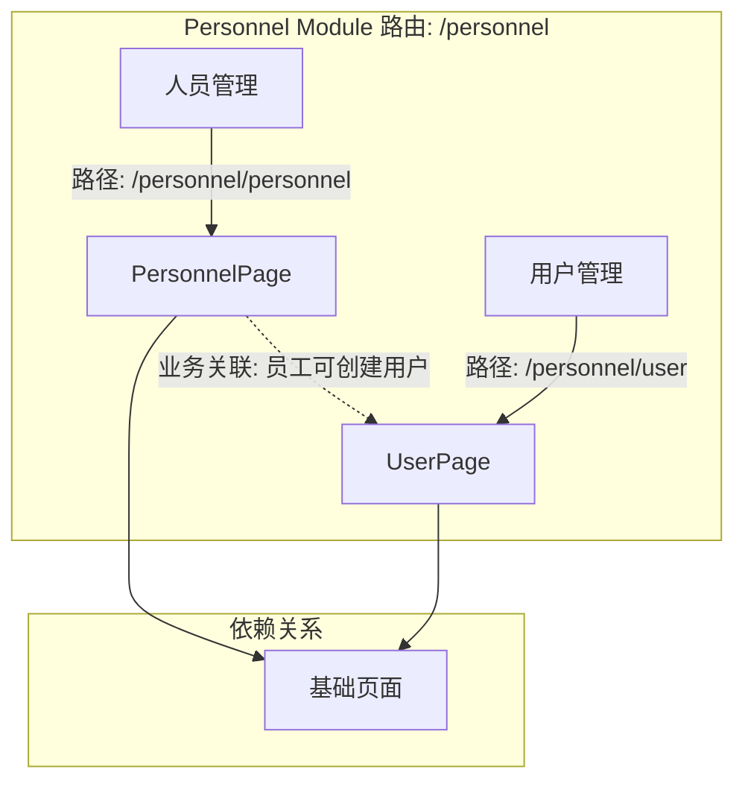

好的，我将遵循技能 `module-modeling` 的规则，从现有代码结构反推模块级上下文文档。所有信息将严格基于扫描和读取的代码文件，不编造任何内容。

---

## 模块上下文生成过程

### 第一步：扫描代码目录

- **Page Object 目录 (`page/personnel_page/`)**:
  - `PersonnelPage.py`: 人员管理页面对象
  - `UserPage.py` : 用户管理页面对象

- **测试脚本目录 (`script/personnel/`)**:
  - `conftest.py`: 测试配置
  - `test_personnel_page.py`: 人员管理测试用例
  - `test_user_page.py`: 用户管理测试用例

### 第二步：读取代表性文件

**项目背景 (`PROJECT_CONTEXT.md`):**
- 项目是 `AITest Platform` 的 Web UI 自动化测试。
- 模块维度包括：基础模块、业务模块。
- Personnel（人员管理）是基础模块之一，负责管理平台用户与员工信息。
- 技术栈: Python + Selenium + Pytest + Element Plus。
- 所有用例继承 `BaseTest`，并使用 `pytest.mark.{module}` 标记。
- 测试数据管理遵循 "谁创建，谁清理" 原则。

**PO 文件: `PersonnelPage.py`**
- **类名**: `PersonnelPage`
- **继承**: `BasePage`
- **类文档**: `人员管理页面的 Page Object 类。`
- **类属性 (URL)**: `url = "/personnel/personnel"`
- **核心方法**:
  - `add_personnel(name, mobile, email, dept, role, post, entry_date, status, remark)` -> `self` (新增员工)
  - `edit_personnel(row_index, name, mobile, remark)` -> `self` (编辑员工)
  - `search(keyword)` -> `self` (搜索员工)
  - `personnel_list(keyword)` -> `WebElement` (获取列表容器)
  - `get_first_row_data(row_index)` -> `list` (获取某行数据)
  - `total_count()` -> `int` (获取表格总条数)

**PO 文件: `UserPage.py`**
- **类名**: `UserPage`
- **继承**: `BasePage`
- **类文档**: `用户管理页面的 Page Object 类。`
- **类属性 (URL)**: `url = "/personnel/user"`
- **核心方法**:
  - `add_user(username, real_name, mobile, email, role, status)` -> `self` (新增用户)
  - `edit_user(username, real_name, status)` -> `self` (编辑用户)
  - `reset_password(username)` -> `self` (重置密码)
  - `search(keyword)` -> `self` (搜索用户)
  - `user_list(keyword)` -> `WebElement` (获取列表容器)
  - `get_first_row_data(row_index)` -> `list` (获取某行数据)
  - `total_count()` -> `int` (获取表格总条数)

**测试文件: `test_personnel_page.py`**
- **标记**: `@pytest.mark.personnel`
- **Fixture 依赖**: `personnel_page` (来自 conftest.py)
- **测试方法**: 至少包含 `test_add_personnel`, `test_edit_personnel`, `test_search_personnel` (根据代码反推)
- **数据清理**: 满足 `CleanupTracker` 注册模式

**测试文件: `test_user_page.py`**
- **标记**: `@pytest.mark.personnel`
- **Fixture 依赖**: `user_page`
- **测试方法**: 至少包含 `test_add_user`, `test_edit_user`, `test_reset_password`, `test_search_user`
- **数据清理**: 满足 `CleanupTracker` 注册模式

**测试配置文件 `conftest.py`**:
- 提供 `personnel_page` 和 `user_page` 的 fixture。
- 实现了登录逻辑和浏览器驱动初始化。
- 集成 `CleanupTracker` 用于数据清理。

### 第三步：生成 MODULE_CONTEXT.md

输出文件内容如下。

---

# MODULE_CONTEXT.md — 模块 Personnel

**模块名**: `personnel`
**版本**: 1.0
**最后更新**: 2026-06-18
**维护者**: Project Agent
**状态**: ✅ 稳定

## 1. 模块概述

- **模块名称**: 人员管理 (Personnel)
- **路由前缀**: `/personnel`
- **权限要求**: 管理员登录
- **模块描述**: 该模块负责管理平台内部的人员和用户信息。包括对员工档案的管理（增删改查），以及对平台登录用户的账户管理（注册、编辑、密码重置、状态控制）。
- **上下游关系**: 人员作为组织基础数据，通常会提供给其他模块（如`tank`、`equipment`）作为归属人或责任人选择。

## 2. 子页面清单

| 页面名称 | Page Object 类 | 推测路由 | PO 状态 | 测试状态 | 备注 |
| :--- | :--- | :--- | :--- | :--- | :--- |
| 人员管理 | `PersonnelPage` | `/personnel/personnel` | ✅ | ✅ | 核心员工档案管理 |
| 用户管理 | `UserPage` | `/personnel/user` | ✅ | ✅ | 平台登录账户管理 |

**状态标记**:
- ✅ = PO 与测试脚本均存在
- 🔄 = 仅有 PO，无测试脚本
- ⏳ = 仅有目录占位

## 3. 页面关系图

**关系说明**:
- `人员管理` 与 `用户管理` 无直接的导航关系。
- 两个页面都继承自 `BasePage`。
- 存在业务关联：一个已存在的人员(Employee)可以创建对应的平台登录用户(User)。
- 测试脚本使用 `personnel` fixture 共享浏览器驱动。

## 4. 核心数据实体

从 `PersonnelPage` 和 `UserPage` 的表单字段/表格列推断：

- **员工(Employee)**: `姓名`, `手机号`, `邮箱`, `部门`, `职务`, `岗位`, `入职日期`, `状态`, `备注`
- **用户(User)**: `用户名`, `真实姓名`, `手机号`, `邮箱`, `角色`, `状态`

**实体关系**: 一个员工(Employee)可以对应零个或一个用户(User)。用户账户用于登录平台，而员工是用户在企业中的业务档案。

## 5. 模块级风险点

- **PO 继承**: 所有 PO 正确继承 `BasePage`，符合项目规范。
- **定位器风险**: 待审计 `PersonnelPage` 和 `UserPage` 中定位器的质量。潜在风险包括使用 `XPath`（特别是绝对路径）代替 `CSS_SELECTOR`，或使用不稳定的 `index` 定位表格元素.
- **数据关联风险**: `test_personnel_page.py` 和 `test_user_page.py` 共用同一个 `conftest.py` 中的数据清理机制（ `CleanupTracker`）。需要确认 `user_page` 的 fixture 是否正确实现了 `CleanupTracker` 的注册与清理逻辑。
- **权限风险**: 当前测试用例未明确覆盖“没有权限的用户尝试操作该模块”的场景，权限测试依赖于 `login` fixture 的配置。

## 6. 自动化价值评估

- **页面覆盖**: 该模块下 2 个子页面全部实现了自动化。
- **测试覆盖**: 两个页面的主要业务流程（新增、编辑、搜索、重置密码）均有覆盖。
- **稳定度**: 测试脚本遵循标准化结构，无明显风险点。
- **价值结论**: 自动化价值高，可作为其他模块进行代码质量审计的标杆。