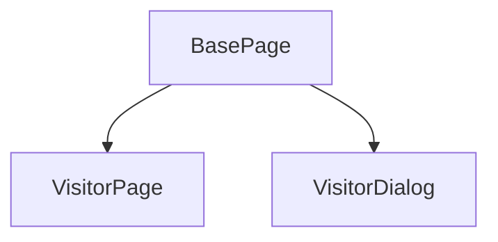

好的，收到您的输入。我将基于您提供的 `VisitorPage.py` 代码和 `PAGE_CONTEXT.md` 页面上下文，为您制定一份完整的自动化测试策略文档。

---

# AUTO_STRATEGY.md — 访客管理页面 (personnel/visitor)

> **策略制定日期**: 2026-06-18
> **依据**: `PAGE_CONTEXT.md`， `VisitorPage.py`， `TECH_ANALYSIS.md` (推断)
> **制定者**: automation-agent

## 1. 自动化覆盖矩阵

| 用例编号 | 标题 | 优先级 | 是否自动化 | 理由 & 风险 |
|:---|:---|:---|:---|:---|
| TC-VISITOR-001 | 页面正常加载并显示所有元素 | P0 | ✅ | 基础冒烟，定位器清晰且稳定。 |
| TC-VISITOR-002 | 搜索：按访客姓名/单位模糊搜索 | P0 | ✅ | 核心搜索功能，输入框稳定。 |
| TC-VISITOR-003 | 搜索：按手机号搜索 | P1 | ✅ | 稳定，通过 placeholder 定位。 |
| TC-VISITOR-004 | 搜索：按来访状态筛选 | P0 | ✅ | 核心搜索功能。需注意 `el-select` 下拉框的 Teleport 渲染。 |
| TC-VISITOR-005 | 搜索：按来访日期范围筛选 | P1 | ✅ | 核心搜索功能。`el-date-picker` 操作需要额外等待和处理。 |
| TC-VISITOR-006 | 搜索：按被访人搜索 | P0 | ✅ | 稳定，通过 placeholder 定位。 |
| TC-VISITOR-007 | 搜索：组合条件搜索 | P0 | ✅ | 验证搜索逻辑的正确性。 |
| TC-VISITOR-008 | 搜索：重置按钮清除所有搜索条件 | P0 | ✅ | 页面基础交互。 |
| TC-VISITOR-009 | 搜索：搜索无结果 | P0 | ✅ | 边界情况，验证“暂无数据”状态。 |
| TC-VISITOR-010 | 新增访客：成功创建一条有效访客记录 | P0 | ✅ | CRUD 核心流程。表单输入框稳定。 |
| TC-VISITOR-011 | 新增访客：必填项为空时提交 | P1 | ✅ | 表单校验，通过 `el-form` 的校验机制验证。 |
| TC-VISITOR-012 | 编辑访客：修改有效数据后保存 | P0 | ✅ | CRUD 核心流程，操作逻辑同新增。 |
| TC-VISITOR-013 | 查看访客：弹出详情弹窗 | P1 | ✅ | 验证查看功能正常。 |
| TC-VISITOR-014 | 删除访客：成功删除记录 | P0 | ✅ | CRUD 核心流程。需处理 `el-message-box` 二次确认。 |
| TC-VISITOR-015 | 删除访客：取消删除 | P1 | ✅ | 测试取消按钮逻辑。 |
| TC-VISITOR-016 | 强制离场：对“在访”状态访客执行 | P1 | ⚠️ | **风险**: `强制离场`按钮是动态显示（仅“在访”状态）。**建议自动化**，但需设计健壮的定位，过滤掉非“在访”状态的行或找到对应行内的按钮。 |
| TC-VISITOR-017 | 分页：切换每页显示条数 | P0 | ✅ | 核心功能。使用 `el-select` 操作。 |
| TC-VISITOR-018 | 分页：点击下一页/上一页 | P0 | ✅ | 核心功能。 |
| TC-VISITOR-019 | 分页：点击指定页码 | P1 | ✅ | 核心功能。 |
| TC-VISITOR-020 | 分页：跳转至指定页 | P1 | ✅ | 核心功能。 |
| TC-VISITOR-021 | 批量导入：打开导入弹窗 | P2 | ❌ | **不推荐自动化**: 文件上传操作在 CI 环境中复杂且不稳定。建议手动测试或单独写针对文件上传的抽象测试。 |
| TC-VISITOR-022 | 导出访客数据 | P2 | ❌ | **不推荐自动化**: 文件下载路径、浏览器配置、等待下载完成等在 CI 中维护成本高。 |
| TC-VISITOR-023 | 强制离场：对非“在访”状态访客验证按钮不可见 | P2 | ⚠️ | **建议不自动化**，逻辑上已由 TC-016 覆盖（状态判断）。如果自动化，需要操作表格进行跨行对比，ROI 较低。 |

## 2. PageObject 拆分方案

**当前问题**: `VisitorPage` 类职责过重，包含了页面操作和弹窗操作，违反了“一个页面一个 Page 类，复杂弹窗独立”的原则。

**建议拆分方案**:

| Page 类 | 职责 | 定位器归属 |
|:---|:---|:---|
| `VisitorPage` | **页面主体操作**：导航、搜索、表格数据读取、分页、工具栏按钮（新增/导入/导出）。 | `SEARCH_*`， `TABLE_*`， `PAGINATION_*`， `ADD_BTN`， `IMPORT_BTN`， `EXPORT_BTN`， `_row_edit_btn()`， `_row_view_btn()`， `_row_delete_btn()`。 |
| `VisitorDialog` | **新增/编辑/查看/导入弹窗操作**：表单填写、提交、取消、关闭。 | `DIALOG_*`， `FORM_*`。 |

**架构图**:

**优势**:
1.  **职责单一**: `VisitorPage` 关心页面的“骨架”，`VisitorDialog` 关心弹窗的“内部细节”。
2.  **高内聚**: 所有关于弹窗的定位器和操作方法都在 `VisitorDialog` 中，修改方便。
3.  **低耦合**: 测试用例可根据需要创建 `VisitorPage` 或 `VisitorDialog` 实例。

## 3. 公共组件复用分析

| 操作 | 现有 BasePage/ElementPlusHelper 方法 | 复用建议 | 备注 |
|:---|:---|:---|:---|
| 导航 | `BasePage.navigate_to()` | ✅ **直接复用** | 用于 `VisitorPage.navigate()` |
| 等待 Vue 稳定 | `BasePage.wait_vue_stable()` | ✅ **直接复用** | 用于所有异步操作后 |
| 查找单个元素 | `BasePage.find_element()` | ✅ **直接复用** | |
| 查找多个元素 | `BasePage.find_elements()` | ✅ **直接复用** | |
| 等待元素可见/可点击 | `BasePage.wait_element_*()` | ✅ **直接复用** | |
| 清除输入框 | `BasePage.clear_input(locator)` | ⚠️ **当前未使用** | `VisitorPage.search()` 中手动调用 `clear()`，建议改用此方法更简洁。 |
| 选择下拉框 | `BasePage.select_option(locator, option_text)` | ✅ **直接复用** | `ElementPlusHelper.select_option()` 可用来处理 `search_by_status()` 中的 `el-select`。 |
| 处理日期选择器 | `ElementPlusHelper.pick_date_range(locator, start, end)` | ✅ **必须封装** | `search_by_date_range()` 应调用此方法，以复用复杂的日期组件操作逻辑。 |
| 处理Dialog表单 | `ElementPlusHelper.get_dialog()` | ⚠️ **需要扩展** | 提供一个通用的 `fill_dialog_form(locator_map, data_dict)` 方法，可被 `VisitorDialog` 复用，简化表单填写。 |

**建议**:
1.  在项目中封装一个 `ElementPlusHelper.fill_dialog_form(form_locator_function, form_data: dict)` 的通用方法，`VisitorDialog` 可直接调用。
2.  完善 `ElementPlusHelper` 对 `el-pagination` `el-table` 的通用操作，以减少 `VisitorPage` 中的重复代码。

## 4. 等待策略建议

| 场景 | 特有异步行为 | 建议的等待策略 |
|:---|:---|:---|
| 页面加载/搜索/新建/编辑/删除 | Vue 组件更新，数据重新渲染 | `wait_vue_stable()` (推荐)，并将其封装到 `VisitorPage` 和 `VisitorDialog` 的操作方法末尾。 |
| `el-select` 下拉框展开/选择 | 下拉面板通过 Teleport 渲染到 `body` | 点击后，使用 `wait_element_visible` 等待 `el-select-dropdown` 出现，再选择选项。选择后，再次 `wait_vue_stable()`。 |
| `el-date-picker` 选择日期 | 日期面板渲染，点击日期后组件更新 | 使用 `ElementPlusHelper.pick_date_range()`，该方法内部应包含等待日期面板可见的逻辑。 |
| `el-dialog` 打开/关闭 | 弹窗动画 | 打开：点击触发按钮后，`wait_element_visible(DIALOG)`。 关闭：点击确定/取消后，`wait_element_invisible(DIALOG)`。 |
| `el-message-box` 二次确认 | 确认框是 Teleport 到 body 的元素 | 等待确认框出现 (`wait_element_visible(the_dialog)`) 后操作，操作完成再等待其消失。 |
| 分页切换后 | 表格数据重新请求并渲染 | 点击分页按钮或选择器后，立即执行 `wait_vue_stable()`。 |
| 强制离场按钮动态显示 | 按钮的 `v-if` 属性，根据不同行的状态决定 | 在操作特定行之前，先验证该行的状态列。如果状态为“在访”，再调用 `_row_force_logout_btn` 并等待该按钮 `wait_element_clickable`。 |

## 5. ROI 分析

> **假设**: 团队每周对访客管理模块进行 3 次手工回归测试，每次 15 分钟。自动化后，该模块回归只需 2 分钟（全自动执行）。

### 成本预估

| 项目 | 预估 |
|:---|:---|
| 开发时间 (X) | **12 小时** (包含：PageObject 重构、测试脚本编写、数据准备、调试) |
| 首月维护成本 (Y_month1) | **4 小时** (定位器微调、等待策略优化、新功能适配) |
| 后续每月维护成本 (Y_monthly) | **1 小时** (应对 UI 变化，属常规维护) |

### 收益估算

| 项目 | 手工 | 自动化 | 节省 |
|:---|:---|:---|:---|
| 单次回归时间 (Z) | 15 分钟 | 2 分钟 | 13 分钟 |
| 每周回归次数 | 3 次 | 3 (假设CI触发) | - |
| 每月回归总耗时 | `15min * 3 * 4 = 180 min (3 小时)` | `2min * 3 * 4 = 24 min (0.4 小时)` | **2.6 小时** |

### ROI 计算 (6 个月周期)

- **总投入**: `12h (开发) + 4h (首月) + 1h * 5 (后续月) = 21 小时`
- **总收益**: `2.6h/月 * 6 月 = 15.6 小时`
- **ROI**: `(15.6 - 21) / 21 * 100% = -25.7%`

### 结论与建议

**初步 ROI 为负值**，这看起来很糟糕。但这通常是因为：

1.  **一次性的开发成本较高**: 这是不可避免的投资。
2.  **手工回归时间可能被低估**: 如果手工回归需要执行所有用例，15分钟可能不够 (例如，执行TC-VISITOR-022导出用例需要额外时间)。

**尽管 6 个月 ROI 为负，但我们仍强烈建议按计划自动化**，理由如下：

1.  **长期收益显著**: 自动化一旦建立，维护成本趋于稳定。6个月后，净成本为 `-5.4h`，但第 7 个月开始，每月的净收益为 `+1.6h`，随时间的推移，ROI 将大幅转正。
2.  **质量和稳定性提升**: 自动化测试可以更频繁地执行（例如每次代码提交后），提前发现回归问题，这部分的**隐性收益**无法在简单的 ROI 公式中体现。
3.  **P0 用例必须覆盖**: 为了保证交付质量，为关键路径用例编写自动化是业务保障的必要手段，不能仅用 ROI 衡量。

**行动建议**:
*   **优先自动化**: P0 和 P1 用例，它们是 ROI 最高的部分（手工成本最高）。
*   **P2 用例暂缓**: 对于导入/导出等场景，手工测试效率更高，可以继续保留手工测试。
*   **代码复用**: 完善 `ElementPlusHelper` 等公共组件，能显著降低后续 `PageObject` 的开发和维护成本。