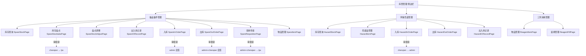

# 模块上下文：warehouse（库管管理）

## 1. 模块概述

- **模块名**: `warehouse`（库管管理）
- **路由前缀**: `#/warehouse/`
- **权限要求**: 需登录 + 库管管理相关角色权限
- **子模块**: 3 个 — 备品备件管理、环保危废管理、三剂消耗管理

## 2. 页面清单

### 2.1 备品备件管理（spare）

| 页面名称 | slug | Page Object 类 | 路由 hash | PO | 测试 | 治理 | 审批链 |
|---------|------|---------------|-----------|:--:|:--:|:--:|-------|
| 库存查询 | spare-stock | `SpareStockPage` | `#/warehouse/spare/stock` | ✅ | ✅ | 🔄 | — |
| 库存盘点 | spare-stocktake | `SpareStocktakePage` | `#/warehouse/spare/stocktake` | ✅ | ✅ | 🔄 | chenqian → tjw |
| 盘点调整 | spare-stock-adjust | `SpareStockAdjustPage` | `#/warehouse/spare/stock_adjust` | ✅ | ✅ | 🔄 | — |
| 出入库记录 | spare-io-record | `SpareIORecordPage` | `#/warehouse/spare/io_record` | ✅ | ✅ | 🔄 | — |
| 入库 | spare-in-order | `SpareInOrderPage` | `#/warehouse/spare/in_order` | ✅ | ✅ | 🔄 | admin 会签 |
| 出库 | spare-out-order | `SpareOutOrderPage` | `#/warehouse/spare/out_order` | ✅ | ✅ | 🔄 | admin+chenqian 会签 |
| 领用申请 | spare-requisition | `SpareRequisitionPage` | `#/warehouse/spare/requisition` | ✅ | ✅ | 🔄 | admin+chenqian → tjw |
| 物品管理 | spare-item | `SpareItemPage` | `#/warehouse/spare/item` | ✅ | ✅ | ✅ | — |

### 2.2 环保危废管理（hazard）

| 页面名称 | slug | Page Object 类 | 路由 hash | PO | 测试 | 治理 | 审批链 |
|---------|------|---------------|-----------|:--:|:--:|:--:|-------|
| 库存查询 | hazard-stock | `HazardStockPage` | `#/warehouse/hazard/stock` | ✅ | ✅ | 🔄 | — |
| 危废品管理 | hazard-item | `HazardItemPage` | `#/warehouse/hazard/item` | ✅ | ✅ | ✅ | — |
| 入库 | hazard-in-order | `HazardInOrderPage` | `#/warehouse/hazard/in_order` | ✅ | ✅ | ✅ | chenqian → admin |
| 出入库记录 | hazard-io-record | `HazardIORecordPage` | `#/warehouse/hazard/io_record` | ✅ | ✅ | ✅ | — |
| 出库 | hazard-out-order | `HazardOutOrderPage` | `#/warehouse/hazard/out_order` | ✅ | ✅ | ✅ | chenqian → admin |

### 2.3 三剂消耗管理（reagent）

| 页面名称 | slug | Page Object 类 | 路由 hash | PO | 测试 | 治理 | 审批链 |
|---------|------|---------------|-----------|:--:|:--:|:--:|-------|
| 物品管理 | reagent-item | `ReagentItemPage` | `#/warehouse/reagent/item` | ✅ | ✅ | 🔄 | — |
| 装填管理 | reagent-fill | `ReagentFillPage` | `#/warehouse/reagent/fill` | ✅ | ✅ | 🔄 | — |

**状态说明**:
- ✅: 完整（有代码 + 有治理文档）
- 🔄: 代码完整，治理文档生成中（本次 SOP 补齐）
- ⚠️: 仅有治理文档，无 PO 代码和测试（orphan docs）
- ❌: 缺失

## 3. 页面关系图

## 4. 公共模式

### 4.1 页面复杂度分三层

| 层级 | 特征 | 页面数 | 页面 |
|------|------|:-----:|------|
| Tier 1 — 只读查询 | 搜索+重置，无 CRUD，无审批 | 5 | spare-stock, spare-stocktake, spare-stock-adjust, spare-io-record, hazard-stock |
| Tier 2 — 标准 CRUD | 搜索+新增+查看+删除，弹窗表单 | 6 | hazard-in-order, hazard-out-order, spare-in-order, spare-out-order, reagent-item, reagent-fill |
| Tier 3 — CRUD + 工作流 | 全部操作 + 行内操作按钮 + 状态感知 + 审批链 | 2 | spare-requisition, spare-item |

### 4.2 JS 弹窗填充模式

5 个 CRUD 页面使用 `_fill_dialog_by_placeholder(placeholder_contains, value)` 通用模式：
- 查找所有 `.el-dialog` 可见元素
- 匹配 placeholder 子串定位 input
- 通过 JS `dispatchEvent(new Event('input'))` + `dispatchEvent(new Event('change'))` 设置值
- `SpareInOrderPage` 有 fallback（无匹配时填充第一个可见 input）；其他页面仅 warn

### 4.3 清理模式

CRUD 页面统一: `search_by_*(name)` → `click_row_button(name, "删除")` → `confirm_message_box()` → `cleanup_tracker.register_entity()` 作为 fallback

## 5. 模块级风险点

1. **自定义 UI 组件**: `SpareRequisitionPage` 使用 `wh-filter-toolbar` 非标准 Element Plus 搜索栏，定位器脆弱
2. **多层弹窗**: CRUD 页面弹窗可能叠加，需关注 z-index 和 Teleport 渲染
3. **审批链依赖**: 4 个页面有审批流，完整 E2E 需多角色协作，当前测试仅覆盖到提交
4. **JS 事件驱动填充**: `_fill_dialog_by_placeholder` 依赖 JS 事件而非 Selenium send_keys，Vue 版本升级可能改变事件行为
5. **日期筛选未充分测试**: 多个页面有 FILTER_DATE，但测试仅 smoke — 未验证实际过滤效果

## 6. 自动化价值评估

| 维度 | 分值 (1-5) | 说明 |
|------|:----------:|------|
| UI 稳定性 | 3 | XPath 定位器为主，但 Element Plus 组件规范统一 |
| 业务覆盖度 | 4 | 15 页面 17 测试文件 90+ 用例，覆盖加载/搜索/CRUD/工作流 |
| 维护效率 | 4 | POM 模式清晰，BasePage 继承统一 |
| 风险发现能力 | 3 | 基础功能覆盖好，深层业务逻辑和审批流覆盖不足 |

<!-- ⚠️ AUTO-GENERATED SECTION BEGIN: module-stats -->
<!-- Source: tools/sync_progress.py — regenerated on each SOP run -->
## 自动统计数据 (更新于 2026-06-22)

| 指标 | 数值 |
|------|:---:|
| 测试文件 | 17 (script/warehouse/test_*.py) |
| Page Object | 15 (page/warehouse_page/*.py) |
| 治理文档 | 90 .md/.yaml 文件 (6 per page × 15 pages) |
| TECH_ANALYSIS | 15 |
| AUTO_STRATEGY | 15 |
| RISK_MODEL | 15 |
| PAGE_CONTEXT | 15 |
| PAGE_INTERFACE | 15 |
| TEST_CASES | 15 |
| consistency-check | 14 |
| SOP 状态 | all-gaps-closed |
| Phase 完成 | Automation, Bug Analysis, Data Sanitization, Execute & Debug, Knowledge, Project Init, Report, Requirement, Test Design |
| 治理完整页面 | 15/15 (全量覆盖) |

> 此段由 sync_progress.py 自动更新。手动编辑会被覆盖。
<!-- ⚠️ AUTO-GENERATED SECTION END: module-stats -->
