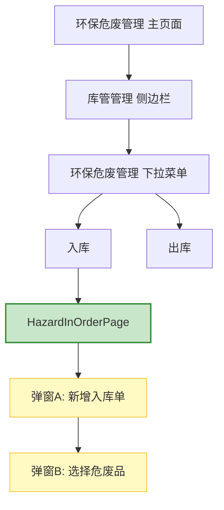

好的，我将遵循 **module-modeling** Skill 的规则，仅从您提供的代码中提取信息，不编造任何内容，为您生成 `warehouse` 模块下的 `hazard-in-order` 子页面的模块上下文文档。

---

## 模块上下文：warehouse/hazard-in-order

### 1. 模块概述

- **模块名**: `warehouse`
- **子页面**: `hazard-in-order`（环保危废入库）
- **推测的路由前缀**: `/wh/` 或 `/warehouse/`（待确认，基于项目通用的路由命名习惯）
- **推测的权限要求**: 需要登录，并拥有“库管管理 - 环保危废管理”相关权限。完整的审批链为 `chenqian → admin`。

### 2. 子页面清单

| 页面名称 | Page Object 类 | 推测路由 | PO状态 | 测试状态 | 备注 |
|:---|---|:---:|:---:|:---:|:---|
| 环保危废入库 | `HazardInOrderPage` | 待确认 (`navigate` 方法通过侧边栏导航，无直接URL暴露) | ✅ (完整) | ✅ (有test) | 8列表格，含嵌套弹窗 |
| 环保危废出库 | `HazardOutOrderPage` (推测) | 待确认 | ⏳ (仅目录占位) | ⏳ (仅目录占位) | 当前模块仅提供了入库页面的资产 |

**状态说明**:
- ✅: 同时存在 `Page Object` 文件和对应的 `test_*.py` 文件。
- 🔄: 存在 `Page Object` 文件，但无对应的测试脚本文件。
- ⏳: 仅在目录中存在占位文件或从上下文推断存在，但无实际代码资产。

### 3. 页面关系图

基于 `HazardInOrderPage` 的 `navigate()` 方法和代码中的业务逻辑，页面间的关系可以推断如下：

### 4. 核心数据实体

从 `HazardInOrderPage` 和测试脚本中推断出以下核心数据实体：

| 实体名称 | 属性 | 类型 | 来源 |
|:---|:---|:---|:---|
| `入库单 (Inbound Order)` | 经办人 (handler) `FILTER_HANDLER / FIELD_HANDLER` | 文本 | PO 定位器 |
| `入库单 (Inbound Order)` | 日期 (in_time) `FIELD_IN_TIME` | 日期 | PO 定位器 |
| `危废品 (Waste)` | 危废品列表 | 表格 | PO 注释描述（弹窗B内选择）|
| `入库单 (Inbound Order)` | 状态 (status) | 状态 | PO 定位器 `FILTER_STATUS` |
| `入库单 (Inbound Order)` | 操作 (action) | 按钮组 | PO 定位器 `BTN_VIEW`, `BTN_EDIT` |

### 5. 模块级风险点

基于现有代码的实际情况，识别以下风险点：

1.  **定位器脆弱性**:
    - 大量使用 **XPath** 进行元素定位（如 `BTN_ADD`, `BTN_SUBMIT`, `FILTER_HANDLER`），尤其是基于文本的XPath (`//button[contains(.,"新增入库")]`)，对UI文案变化非常敏感。
    - **字段定位器** (`FILTER_HANDLER`, `FIELD_HANDLER`, `FIELD_IN_TIME`) 使用了 `//input[@placeholder="..."]` 形式，虽然比基于文本的 XPath 稍好，但仍不如 ID 或 data-* 属性稳定。

2.  **BasePage 依赖**:
    - `HazardInOrderPage` 正确继承自 `BasePage`，并使用了 `wait_vue_stable()`, `click()`, `navigate_to()` 等封装的父类方法，这是一个好的模式。

3.  **并发与清理风险**:
    - 测试脚本 `test_hazard_in_order.py` 中，虽然 `TestHazardInOrderInteraction.test_select_waste_dialog` 有打开弹窗，但未进行完整的新增-提交-清理流程。`CleanupTracker` 虽然被 `import`，但尚未在现有测试中实际使用（如创建并销毁一个入库单）。如果后续加入完整CRUD的测试，需要确保所有创建的数据都在teardown中被清理，遵循“**谁创建，谁清理**”的原则。

4.  **审批链外部依赖**:
    - 注释中明确提到审批链为 `危废出库审批链 (chenqian → admin)`。这意味着自动化测试若需要验证完整的“新增 → 提交审核 → 审批通过”流程，将**依赖外部角色**（`admin` 用户的登录和操作）。当前的测试脚本并未覆盖这部分，仅停留在页面加载、搜索和部分弹窗操作，减少了对外部系统的依赖，但也降低了端到端业务的覆盖度。

5.  **表格交互待增强**:
    - `HazardInOrderPage` 目前没有封装表格相关的通用操作方法（如获取所有行、点击指定行）。`TABLE_ROWS` 定位器也未在PO中定义。这限制了与表格内部元素交互的能力，测试脚本中是通过直接调用 `driver.find_elements()` 来绕过PO封装的，增加了维护成本。

### 6. 自动化价值评估

| 评估维度 | 分值 (1-5) | 说明 |
|:---|---|:---|
| **UI稳定性** | 3 | XPath定位器在UI变更时稳定性中等，但核心交互流程（搜索、弹窗）已覆盖。 |
| **业务覆盖度** | 3 | 已覆盖核心页面的加载、搜索、新增弹窗打开。但仍缺少 **CRUD链路**、**嵌套弹窗选择**、**审批流**、**错误场景** 的测试。 |
| **维护效率** | 4 | 代码结构和POM模式清晰，有基础方法封装，便于后续扩展。 |
| **风险发现能力** | 3 | 当前测试可以捕获页面渲染和基础功能的中断性缺陷，但深层次的逻辑和业务联动缺陷较难发现。 |

**总体评价**：该子页面的自动化程度处于“**基础功能覆盖**”阶段。可以高效地作为集成测试中的烟雾测试，验证核心模块是否正常。如需提升自动化价值，需要在**数据构造与清理**、**复杂业务路径**（特别是审批流）上投入更多资源。

<!-- ⚠️ AUTO-GENERATED SECTION BEGIN: module-stats -->
<!-- Source: tools/sync_progress.py — regenerated on each SOP run -->
## 自动统计数据 (更新于 2026-06-17 21:52)

| 指标 | 数值 |
|------|:---:|
| 测试文件 | 16 (script/warehouse/test_*.py) |
| Page Object | 14 (page/warehouse_page/*.py) |
| 治理文档 | 26 .md 文件 |
| TECH_ANALYSIS | 5 |
| AUTO_STRATEGY | 5 |
| RISK_MODEL | 5 |
| PAGE_CONTEXT | 6 |
| SOP 状态 | completed |
| Phase 完成 | Automation, Bug Analysis, Data Sanitization, Execute & Debug, Knowledge, Project Init, Report, Requirement, Test Design |

> 此段由 sync_progress.py 自动更新。手动编辑会被覆盖。
<!-- ⚠️ AUTO-GENERATED SECTION END: module-stats -->